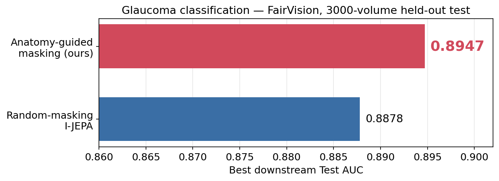

# I-JEPA for FairVision OCT Glaucoma Classification

Self-supervised pretraining using [I-JEPA](https://github.com/facebookresearch/ijepa) (Assran et al., CVPR 2023) on [Harvard FairVision](https://github.com/Harvard-Ophthalmology-AI-Lab/FairVision) OCT data, evaluated via frozen probe + fine-tune on binary glaucoma classification.

## Current workshop study

The canonical paper is `paper\genai4health2026\main_submission.tex`; the older
`main.tex` in that directory is not the current submission source. The active
investigation is recorded in `autopilot\investigations\delivered_task\BOARD.md`,
with the baseline audit in `VERSION_BOARD.md`.

The current paper compares **frozen MeanPool probes** after different masking
policies. CENTROID (historically named `oracle`) reaches **0.8855** test AUC;
the **0.8947** value below is from a different, fine-tuned evaluation regime.
The encoder operates on **2D B-scans**, followed by pooling across a volume.
There is one completed pretraining continuation per policy and the same test
split was repeatedly inspected. The results describe those runs, not an
established ranking over independent retrainings.

Tissue-directed rectangle placement improves the observed AUC. More precise
anatomy-shaped or coverage-based implementations do not consistently improve it,
but target area, retained context, guide provenance and collation differ.
Historical COVER masks have a documented post-placement truncation defect.
Corrected-code diagnostics must not be reported as corrected-model AUC results.

## Historical fine-tuning and frozen-probe results

Highest recorded downstream point estimate: **0.8947 Test AUC** (FairVision,
3000-volume test split), fine-tuned MeanPool on the CENTROID encoder. The table
below gives regime-matched comparisons; not every difference is statistically
resolved, and none is a replicated policy-level comparison.

Paired bootstrap, B=2000, on the 3000-volume Test split:

| Regime | Probe | Random | Oracle | Δ | p |
|---|---|---|---|---|---|
| Frozen | MeanPool | 0.8746 | 0.8855 | +0.0109 | <0.0005 |
| Fine-tune | MeanPool | 0.8868 | **0.8947** | +0.0079 | 0.001 |
| Fine-tune | CrossAttnPool | 0.8872 | 0.8937 | +0.0065 | 0.009 |
| Fine-tune | AttentiveProbe d=1 | 0.8878 | 0.8901 | +0.0023 | 0.26 (ns) |

Source: [`docs/experiments/frozen/oracle_meanpool_sweep.md`](docs/experiments/frozen/oracle_meanpool_sweep.md), [`docs/experiments/finetune/oracle_finetune.md`](docs/experiments/finetune/oracle_finetune.md).

## Probe-architecture ablation (random-init baseline)

Random-init I-JEPA ViT-B/16, 100 epochs SSL on 600K OCT slices. Full 2×3 matrix on the 3000-volume Test split.

| Method | Probe | Params (trainable) | **Test AUC** |
|---|---|---|---|
| **Fine-tune + LLRD γ=0.5** | AttentiveProbe d=1 + Linear | 7.17M + 86M encoder | **0.8878** |
| **Fine-tune + LLRD γ=0.5** | CrossAttnPool + Linear | 277K + 86M encoder | **0.8872** |
| **Fine-tune + LLRD γ=0.5** | **MeanPool + Linear (0 probe params)** | **2.3K + 86M encoder** | **0.8868** |
| Frozen probe | CrossAttnPool + Linear | 277K | 0.8791 |
| Frozen probe | MeanPool + Linear | 2.3K | 0.8746 |
| Frozen probe | AttentiveProbe d=1 + Linear | 7.17M | 0.8706 |

The fine-tuned probe point estimates are close, with no resolved pairwise
difference in the recorded comparison; this does not establish equivalence.
MeanPool uses no trainable pooling parameters. Full historical analysis:
[`docs/experiments/frozen/ablation_analysis.md`](docs/experiments/frozen/ablation_analysis.md).

## Method

- **Pretraining**: I-JEPA on 256×256 OCT slices (FairVision Training split, 600K slices). ViT-B/16, 100 epochs, peak LR 0.00025, EMA 0.996→1.0, effective batch 512.
- **Downstream input**: Frozen ViT encodes each slice → per-slice 768-dim token. 100 slices per volume.
- **Probes**: MeanPool / CrossAttnPool / AttentiveProbe d=1, all with linear binary head.
- **Fine-tune**: LLRD γ=0.5 with base LR 2e-4, 50 epochs planned / early-stopped by patience=15.

See [`docs/architecture/`](docs/architecture/) for the full spec.

## Dataset

Harvard FairVision Glaucoma subset: 10,000 subjects (6K Train / 1K Val / 3K Test), each with a 200×200×200 OCT B-scan volume. Binary label glaucoma/not. ~48.5% positive prevalence — balanced. Available on [HuggingFace](https://huggingface.co/datasets/ming0100/Harvard_FairVision).

## Pretrained checkpoints

Both pretraining arms are published on Hugging Face (private repo — request access):

**[`yfeng0206/ijepa-3d-oct-checkpoints`](https://huggingface.co/yfeng0206/ijepa-3d-oct-checkpoints)**

| arm | checkpoints |
|---|---|
| `random-posfix-100ep/` | ep025, ep050, ep075, ep100 — stock uniform-random block placement |
| `oracle-anatomical-100ep/` | ep050, ep075, ep100 — anatomy-guided target placement, forked from random ep025 |

Each `.pth.tar` is a full training state (`encoder`, `target_encoder`, `predictor`, `opt`, ...); use `target_encoder` (the EMA teacher) for feature extraction. `MANIFEST.json` records sha256, epoch and original run path for every file.

> The `-lowest-pretrain-loss-*` files are **not** better checkpoints. They were selected by lowest pretraining loss, which in I-JEPA is close to an anti-signal — the random arm's minimum is epoch 1. Use `ep100`.

## Roadmap

- Phase 1 (done): Random-init I-JEPA SSL → frozen probe + fine-tune evaluation
- Phase 2 (done): Probe architecture ablations — full 2×3 matrix (3 probes × frozen/fine-tune)
- Phase 3 (done): Interpretability — occlusion attribution, patch aggregate, bootstrap CI
- Masking strategy (Rung 1, done): anatomy-guided "oracle" masking beats random — frozen +0.010 (p<0.0005), fine-tune +0.008
- Phase 4 (deferred): Foundation-model baselines on the same Test split (DINOv3, OCTCube); no such job is started by the current investigation.
- Phase 5 (planned): 3D-aware SSL extension (multi-view / axial)

Details and backlog: [`docs/research_log.md`](docs/research_log.md).

## Documentation

| | |
|---|---|
| **Full index** | [`docs/README.md`](docs/README.md) |
| Architecture | [`docs/architecture/`](docs/architecture/) |
| Experiments | [`docs/experiments/`](docs/experiments/) |
| Citations & related work | [`docs/reference/citations.md`](docs/reference/citations.md) |
| Interpretability | [`docs/experiments/interpretability.md`](docs/experiments/interpretability.md) |
| Lessons learned | [`docs/lessons_learned.md`](docs/lessons_learned.md) |
| Research log | [`docs/research_log.md`](docs/research_log.md) |

## References

Key citations (full bibliography with BibTeX: [`docs/reference/citations.md`](docs/reference/citations.md)):

- Assran et al., *Self-Supervised Learning from Images with a Joint-Embedding Predictive Architecture* (I-JEPA), CVPR 2023. [arXiv:2301.08243](https://arxiv.org/abs/2301.08243)
- Luo et al., *FairVision: Equitable Deep Learning for Eye Disease Screening*, 2024. [arXiv:2310.02492](https://arxiv.org/abs/2310.02492)
- Park et al., *Relational Knowledge Distillation*, CVPR 2019. [arXiv:1904.05068](https://arxiv.org/abs/1904.05068)

Full bibliography with context: [`docs/reference/citations.md`](docs/reference/citations.md).
