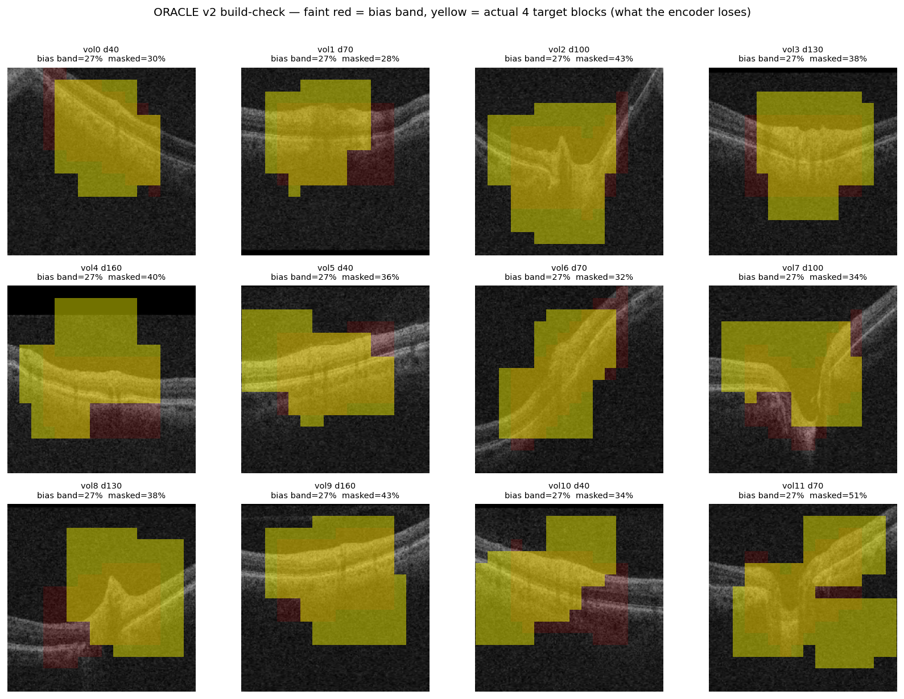

# Anatomy-Guided Masking for OCT JEPA — Research Plan (detailed)

Branch: `ijepa-mask`. Code: [`src/masks/curriculum.py`](../../src/masks/curriculum.py).

> **This is a living plan.** The status tracker (§0) is the source of truth for "where are we." After a context reset: read §0, then the section referenced by the first TODO row.

## Approach



The focus is the **masking strategy for JEPA**, demonstrated on OCT glaucoma. The thesis, by analogy to CNNs: random masking teaches general structure (like early conv layers); masking the **diagnostically important region** teaches task-specific structure (like deep layers). We test this in three rungs:

```
RUNG 1  ORACLE      hand-pick the glaucoma region (known from our interpretability)
                    -> proves WHERE you mask matters for JEPA; sets the ceiling;
                       cheap kill if it doesn't beat random
RUNG 2  SELF-GUIDED teacher feature clusters discover that region with NO labels
                    -> proves we reach the ceiling automatically; validated against
                       the supervised attribution map
RUNG 3  CURRICULUM  random -> specific within one run (general -> specific over time)
                    -> the deployable method; best downstream AUC and/or fewer epochs
```

Substrate: **2D I-JEPA** (the existing infra on this branch). The masking idea is orthogonal to 2D-vs-3D, so 3D V-JEPA is an extension (§12), not a dependency.

## 0. Status tracker — planned vs implemented vs next

**NEXT IN CODE:** G2a (free, no rerun) — cluster teacher features and overlay on the existing attribution PNGs to confirm clusters match anatomy. Then build the ORACLE mask (Rung 1). Nothing in the code rows below is implemented yet.

Legend: DONE / WIP / TODO / DROPPED

### Decisions locked

| # | Decision | State | Detail |
|---|---|---|---|
| D1 | Focus = anatomy-guided masking for JEPA (oracle -> self-guided -> curriculum) | DONE | top, §1 |
| D2 | DROP R2 loss-guided (MAE-era, fights JEPA, confirmed by literature) | DONE | §8 |
| D3 | DROP R3a intensity (too crude, ~= R3b-degenerate) | DONE | §8 |
| D4 | Rung 1 = ORACLE v2 retina-following band (intensity-localized, ~25% region, NOT a fixed box) | DONE | §5.1 |
| D5 | Rung 2 = self-guided cluster (R3) + NCut bi-partition (R4) | DONE | §5.2 |
| D6 | Rung 3 = random->specific curriculum, end-to-end | DONE | §5.3 |
| D7 | Masks must be PER-IMAGE dynamic (no position memory) | DONE | §4 |
| D8 | R3 cluster: top-1 selection, K controls region size; target 20-40% | DONE | §5.2 |
| D9 | Warm-start ep25 for oracle/self-guided SCREEN; end-to-end for curriculum | DONE | §6 |
| D10 | Self-supervised mask converges on supervised attribution | DONE | §7 |
| D11 | Substrate = 2D I-JEPA; 3D V-JEPA = extension | DONE | §12 |

### Code changes (map to `src/masks/curriculum.py` unless noted)

| # | Change | State | Code location | Notes |
|---|---|---|---|---|
| C1 | ORACLE mode `anatomical_prior` (v2 curve-following ribbon, lateral 0.6) | DONE + LOCKED | `_anatomical_prior_weight_grid_for_image`, `VALID_MODES`, generate(), update_after_iter early-return; config `patch_oracle_anatomical.yaml` + AML `aml_patch_oracle.yml` | per-column ribbon follows curve/tilt; affine-invariant (normalization-robust); T_total-respect fix; verified on 12 real glaucoma slices (masks ~66% retina, leaves ~34% context) |
| C2 | R3b selection `top_half` -> `top_1` (or `n_foreground_clusters`) | TODO | `_foreground_clusters` (~L452) | currently masks ~50% regardless of K |
| C3 | Add R4 `self_similarity` mode (NCut bi-partition on teacher features) | TODO | new method + `VALID_MODES` | per-image, parameter-free |
| C4 | Remove `loss_guided` (R2) and `intensity_foreground` (R3a) from `VALID_MODES` | TODO | `VALID_MODES` (~L98) | keep code dormant for reproducibility |
| C5 | `r_max=1.0` + hard-switch profile (step) for warm-start screen | TODO | `_update_r_t` (~L298), config | current cap 0.5 = never fully specific |
| C6 | Expose K as ablation knob (presets K=2,4,8) | TODO | config + `n_clusters` (~L193) | |
| C7 | End-to-end curriculum schedule (random->specific over full run) | TODO | `_update_r_t` + train loop | Rung 3 |

### Validation gates (pruned — see §10 for why the rest were inferable)

| Gate | Check | State | Cost |
|---|---|---|---|
| G2a | Cluster ep25 features, overlay on EXISTING attribution PNGs (free reuse). Gates the self-guided rung. THE one real pre-flight gate. | TODO | ~1 GPU-hr |
| oracle build-check | Render v2 retina mask on slices; band-finder hit retina at ~25%? | DONE on synthetic (`scripts/oracle_build_check.py`); rerun with `--data_dir` on real OCT before launch | minutes |
| live monitoring | rep_diversity/cos_sim in every run, early-kill on collapse (replaces stability mini-runs) | TODO | free |
| G2b (opt) | regen `patch_aggregate` .npz for numeric mask-vs-attribution correlation (paper figure) | TODO | few hrs |

Dropped as inferable/redundant: G1 (folded into G2a), oracle region-size/coverage-A (by construction), self-guided per-image variation (by construction), self-guided-matches-oracle (= G2a), G5 stability mini-runs (caught live).

### Training runs (AML, after gates)

| Run | Rung | Init | State |
|---|---|---|---|
| R1 random | baseline | from scratch | DONE (ep25, ep100 exist) |
| ORACLE | 1 | warm-start ep25 | TODO |
| R3 cluster K2/K4/K8 | 2 | warm-start ep25 | TODO |
| R4 NCut | 2 | warm-start ep25 | TODO |
| CURRICULUM | 3 | end-to-end 100ep from scratch | TODO |

### Already done (don't redo)

| Item | State |
|---|---|
| Curriculum infra (`CurriculumMaskGenerator`, ramp, DDP, checkpoint) | DONE — `42ff6cd` |
| Statistical bug fixes (loss-map NaN-init, intensity tie-safe) | DONE — `39a5743` (now mostly moot, see §8) |
| Interpretability attribution maps (slice curves, patch aggregate, disc rim, OD/OS) | DONE — committed in `results/summary/` |

---

## 1. The thesis (CNN-depth analogy)

A CNN learns general features early (edges, textures) and specific features deep (task structure). Masked pretraining should mirror this over TRAINING TIME: random masking teaches general structure; masking the diagnostically important region teaches task-specific structure.

```
EPOCH:    0 ----------------- 50 ----------------- 100
MASK:     |--- random -------|--- specific --------|
LEARNS:   |--- general ------|--- task-specific ---|
ANALOGY:  |--- early CNN ----|--- deep CNN --------|
```

Two wins to measure:
1. Higher downstream AUC at same compute (specific masking learns better features).
2. Same AUC in fewer epochs (specific masking is more efficient).

## 2. Why this direction (research positioning)

### MAE vs JEPA: difficulty masking does NOT transfer

In MAE, loss = pixel reconstruction error; "hard" patches = high-frequency texture/noise. Difficulty-guided masking (HPM, AnatoMask) corrects MAE's weakness of wasting capacity on trivial smooth regions.

JEPA predicts in LATENT space — it already abstracts away noise by design. "Hard to predict embedding" on OCT often means speckle noise (high-variance, low-information). Difficulty masking would fight JEPA's design and chase noise. Confirmed by the literature: I-JEPA and V-JEPA both use random block masking; every difficulty/adversarial masking paper is MAE-based; JEPA improvements (DMT-JEPA) come from the TARGET side, not mask difficulty. **This is why R2 (loss-guided) is dropped.**

### What works for JEPA = mask coherent SEMANTIC regions

I-JEPA's own design masks "large semantic blocks." SemMAE masks semantic parts. Self-Guided MAE masks the object cluster. The winning direction is region/structure-aware masking — exactly Rungs 1-2.

### Is our idea already done? Partially — the gap is clear

| Work | Masks important region | Self-guided (no external models) | JEPA | OCT |
|---|---|---|---|---|
| Mask What Matters (2025) | yes (lesions/organs, high ratio) | NO — needs BiomedCLIP + SAM + text | no (SparK) | medical, not OCT |
| Self-Guided MAE (NeurIPS 2024) | yes (object cluster) | yes | no (MAE) | no |
| SemMAE (NeurIPS 2022) | yes (parts) | partial | no (MAE) | no |
| DMT-JEPA (2024) | target-side, not mask | yes | yes | no |
| US-JEPA (2026) | standard I-JEPA masking | — | yes | ultrasound |
| **OURS** | yes | **yes** | **yes** | **yes** |

The concept is validated (Mask What Matters proves masking important medical regions works), which de-risks us. The combination self-guided + JEPA + OCT + attribution-validated is unclaimed.

## 3. Masking mechanics and key numbers (read before §5)

This is I-JEPA masking, NOT V-JEPA. Do not assume the V-JEPA 90% mask ratio.

### I-JEPA block config (from `multiblock.py`, unchanged by curriculum)

| Param | Value | Meaning |
|---|---|---|
| `enc_mask_scale` | (0.85, 1.0) | context block = 85-100% of patches |
| `pred_mask_scale` | (0.15, 0.2) | each target block = 15-20% |
| `nenc` | 1 | one context block |
| `npred` | 4 | four target blocks |

On the 256-patch grid (16x16):
- Encoder SEES ~60-75% (context block minus the 4 target regions removed from it)
- Predictor PREDICTS the union of 4 target blocks ~= 40-50% (they overlap)
- This is the LOW-mask-ratio regime. V-JEPA's 90% does not apply.

### Two percentages — do not conflate

| | What | Set by | Curriculum changes it? |
|---|---|---|---|
| **(A) predicted fraction / mask ratio** | ~40-50% (the 4 target blocks) | I-JEPA block config | NO — held constant across runs |
| **(B) important-region size** | the oracle/cluster/NCut region we bias the 4 blocks toward | the masking strategy | YES — this is the knob |

The curriculum changes only the LOCATION of the 4 target blocks (their top-left), biasing them toward the important region. Same block count, same size, same encoder context. (A) stays constant so runs differ only in WHERE, not HOW MUCH — required for a clean ablation.

### (B) matters via block overlap

The 4 blocks are fixed-size (15-20% each, ~38-51 patches). Bias them into a region of size (B):
- B too small (~12%): blocks are bigger than the region, pile up, overlap heavily -> effective unique coverage DROPS, blocks spill out. "Covering too little."
- B too big (~50%): blocks spread freely, bias ~= random. No effect.
- B ~25% (>= ~50 patches): 4 distinct blocks fit with modest overlap. Sweet spot.

So the "20-40%" target throughout is **region size (B)**, a geometric constraint so 4 fixed blocks fit meaningfully — NOT the mask ratio (A).

### Watch both at runtime

- Effective predicted coverage (A): should stay ~constant vs R1. If guided blocks overlap too much it silently drops — a confound.
- Important-region size (B): should sit in 20-40%.

## 4. Hard constraint — masks must be PER-IMAGE dynamic

OCT scans are NOT positionally aligned: different patients have different disc/macula positions, scan offsets, anatomical proportions. A mask that memorizes "always mask grid position (5,7)" learns position, not structure — what's at (5,7) is different anatomy per image.

Every guided mask is re-computed per image from that image's own content. No global position-based EMA grids. (This is why the old position-static R2 is dead — §8.)

The ORACLE uses a retina-following spatial prior computed per-slice from intensity (§5.1) — image-adaptive, no fixed box.

## 5. The three rungs

### 5.1 Rung 1 — ORACLE (retina-following band mask, "v2")

Purpose: prove that masking the KNOWN diagnostic region beats random under JEPA, and set the ceiling. Cheap kill if it fails.

We already know where glaucoma signal is, from `docs/experiments/interpretability.md`:
- Per-patch attribution concentrates on the B-scan center (`results/summary/05_patch_aggregate.png`)
- 3 FT probes converge on the disc rim (r=0.94 slice-level)
- Glaucoma signal = RNFL/GCL, the upper layers of the retinal band

**Why NOT a fixed box.** The retinal band sits at DIFFERENT vertical positions per slice (retina curves at fovea/disc; scans are tilted/offset). A fixed central box would clip the retina in some slices and include vitreous/sclera in others — a weak, diluted oracle. A weak oracle is dangerous: if it fails to beat random we might wrongly kill the thesis.

**Oracle v2 — retina-following band (recommended).** Per slice:
```
1. row_intensity[y] = mean pixel intensity across row y
2. retinal band = contiguous high-intensity rows (bright band between
   dark vitreous above and darker choroid below)
3. add a small vertical margin (a few rows) around the band
4. PER-COLUMN centroid (ribbon) -> the band FOLLOWS the curved/tilted retina,
   not a rigid rectangle (validated on real data, see below)
5. mask target = the band across the central 60% of x (oracle_lateral_frac=0.6),
   leaving the lateral retinal edges as context
```
Intensity here only LOCALIZES the retina (then we mask within it); this is not the dropped R3a intensity-mask, which used intensity AS the mask signal.

**Final oracle config (locked):** `oracle_region_frac: 0.28`, `oracle_lateral_frac: 0.6`, `oracle_row_offset: 0.0`, `oracle_min_band_rows: 3`, `r_max: 1.0`, `T_warm: 25`, `T_total: 30`.

**Bias region vs actual mask — do not confuse.** The red band is the BIAS REGION (where the 4 I-JEPA target blocks are encouraged to land), NOT a pixel mask. I-JEPA still samples 4 contiguous target blocks; the encoder sees the 85-100% context minus them. We do NOT add artificial holes/gaps — that would be a new masking mechanism and muddy the ablation. The clean knob is the bias-region width (`lateral_frac`).

**Sizing — avoid "too little" / "too aggressive" (measured on real OCT, full retina ~29% of image):**
- `lateral_frac` is the real knob; `r_max` barely moves it (block size dominates the thin band).
- 0.8 -> masks ~69% of retina (too aggressive; ambiguous if it fails).
- **0.6 -> masks ~66%, leaves ~34% lateral retinal context. Chosen.** Strong retina-focus, predicts central retina from lateral retina (RNFL continuity), failure is unambiguous.
- 0.4-0.5 -> drifts toward a narrow central-lane prior, not "retinal band" masking.
- Why not add gaps: JEPA predicts in latent space and tolerates high masking (V-JEPA masks 90%); the 4 contiguous blocks already leave natural gaps + lateral context. No explicit holes needed.

Build-check (not a separate gate): `scripts/oracle_build_check.py --data_dir <real OCT>` renders, per slice, the faint-red bias band AND one sampled set of the 4 actual yellow target blocks (what the encoder truly loses). Verified on 12 real glaucoma slices: ribbon follows curve/tilt/dip, masked ~37% of image, lateral retina stays visible.

Implementation notes (bugs caught in review, all fixed):
- **Normalization-robust detector.** Training applies ImageNet `Normalize` and `generate()` gets the normalized batch. The detector subtracts the per-slice min (affine-invariant) instead of `clamp(min=0)`, so raw and normalized give identical masks and dim slices don't collapse to center-row. `oracle_build_check.py` asserts raw == normalized.
- **Curve-following ribbon (was a v2-simple limitation, now FIXED).** Real data showed a rigid rectangle missed the curved/tilted retina. The detector now uses a per-column centroid (smoothed) so the band follows the retina; verified on real OCT.
- **Explicit `T_total` wins.** `set_epoch(epoch, total_epochs)` no longer overwrites a config-set `T_total`. Without this, the loop's `total_epochs=100` turned the oracle hard-switch (`T_total: 30`) into a slow full-run ramp (~7% biased at ep30). Configs omitting `T_total` keep legacy full-run behavior.
- **Region size.** `oracle_region_frac: 0.28` rounds to ~27% on the grid at lateral 0.6 — inside the 0.20-0.40 band.

**Oracle variants (refine only if v2 underperforms):**
- v1 fixed central box — crude fallback / sanity baseline
- v3 RNFL-focused — `oracle_row_offset: -0.06` shifts the band up toward RNFL (gentler than -0.12, which leaked into vitreous on steep slices)

This is the OCT/JEPA/self-contained analog of Mask What Matters (which needs text + SAM). The oracle may "peek" at domain knowledge (it is the upper bound); the self-guided rung is NOT (§7).

Run: warm-start from R1 ep25, train to ep100 with the oracle mask. Compare to R1 ep100.
- Oracle > random -> premise confirmed, proceed to Rung 2.
- Oracle ~= random with v2 (a good oracle) -> thesis dead, stop. (cheap kill, ~one run)

### 5.2 Rung 2 — SELF-GUIDED (discover the region without labels)

Purpose: recover the oracle's benefit automatically, no labels/text/SAM. Two variants:

**R3 cluster_foreground (primary).** K-means the per-image teacher features, mask the single hardest/most-coherent cluster (top-1). Already per-image dynamic (verified: `_assign_per_image`). Fixes needed:
- Selection `top_half` -> `top_1` so K controls region size (currently masks ~50% regardless of K — the bug behind the coverage concern).
- K is unvalidated; ablate K in {2, 4, 8}.

Region size by K (top-1, balanced clusters, 256-patch grid):

| K | region B | verdict |
|---|---|---|
| 2 | ~50% (128 patches) | too coarse, bias ~= random |
| 4 | ~25% (64 patches) | sweet spot — 4 blocks fit |
| 8 | ~12% (32 patches) | too narrow, blocks pile up |

**R4 self_similarity (secondary).** Bi-partition the per-image teacher similarity matrix via Normalized Cut (K=2 by construction, parameter-free), mask the structured half. Self-Guided MAE lineage, adapted to JEPA/OCT. Must verify the partition is anatomical, not just bright-vs-dark intensity (else it degenerates to the dropped R3a) — check correlation of the partition with raw patch intensity.

Validation (G2, G4): the self-guided region must (a) match the oracle region and the attribution map, (b) vary per image. See §7.

### 5.3 Rung 3 — CURRICULUM (random -> specific)

Purpose: the deployable method and the cleanest test of the thesis. One end-to-end run from scratch, mask transitions random -> specific over training time.

```
ONE run from scratch, 100 epochs:
  early epochs:  random multi-block       (general features)
  ramp:          increasing fraction biased toward specific region
  late epochs:   specific (oracle or self-guided winner)
```

`r_t` (biased fraction) is consumed as a Bernoulli per pred-block so small values still have effect. The "specific" end is whichever of oracle / R3 / R4 won Rung 2.

Compare against: R1 ep100 (pure random, exists) and the warm-start results (§6).

## 6. Checkpoint strategy — warm-start screen vs end-to-end

| | Warm-start from ep25 | End-to-end 100ep from scratch |
|---|---|---|
| Role | cheap SCREEN | end-to-end |
| Used for | Rung 1 (oracle), Rung 2 (self-guided) | Rung 3 (curriculum) |
| Tests | "does specific masking improve a partially-trained model? save compute?" | "does a random->specific curriculum beat random in one run?" |
| Cost | 75 more epochs/arm, ep25 shared | full 100ep/arm |
| Confound | mixes warm-start + mask benefit | clean, one variable |
| Maps to | the "fewer epochs" win | the "better AUC" win |

Rationale: warm-start is the efficient way to screen oracle and self-guided (shared start, mask is the only variable). The curriculum IS the thesis (general->specific over one continuous run), so it must be end-to-end. Warm-start results become the efficiency ablation.

## 7. Self-supervised mask meets supervised attribution

The masking literature can't prove their mask hits the "important" region — they have no independent ground truth. We built one: the occlusion-attribution maps show exactly where the supervised glaucoma probe attends.

Claim:
> The self-guided mask (R3/R4), with no labels, selects the same region the supervised probe uses (correlation r = X with the attribution map). Masking that region improves downstream AUC.

This converts the interpretability work into the validation backbone. Critical separation: the ORACLE may peek at attribution (it is the upper bound); the SELF-GUIDED rung must not — only then is the convergence a real discovery, not leakage.

## 8. What's dropped and why

- **R2 loss_guided (DROPPED).** MAE-era difficulty masking. JEPA predicts in latent space and abstracts noise by design; "hard" on OCT = speckle = low info. No JEPA paper uses difficulty masking. The prior `_loss_map` cold-start fix (`39a5743` G1) becomes moot — the global grid is removed.
- **R3a intensity_foreground (DROPPED).** Brightness threshold is too crude; degenerates to "bright = tissue." The G2 tie-fix (`39a5743`) goes dormant — mode stays in code, not exposed.

## 9. Code changes

See §0 code table (C1-C7). Summary: add ORACLE (`anatomical_prior`) and R4 (`self_similarity`) modes; fix R3 selection to top-1; remove R2/R3a from `VALID_MODES`; add `r_max=1.0` hard-switch (warm-start) and end-to-end curriculum schedule (Rung 3); expose K.

Keep: Bernoulli-per-block `r_t`; encoder mask bit-identical to baseline (clean ablation); DDP all_reduce on every rank; cluster maturity gates; checkpoint integration.

## 10. Validation gates (pruned — only what can't be inferred)

Most of the originally-planned gates were inferable-by-construction or redundant. What's left is the minimum that tests something genuinely unknown.

| Check | What it tests | Why it's NOT inferable | Cost |
|---|---|---|---|
| **G2a** (the one real pre-flight gate) | Cluster ep25 teacher features K in {2,4,8}, overlay on committed attribution PNGs. Do clusters match the diagnostic region (not background, not just intensity)? Report region-size per cluster. | The whole self-guided rung depends on this and it cannot be predicted — clusters might be anatomy or noise. | ~1 GPU-hr (FREE reuse — do NOT rerun interpretability) |
| **Oracle build-check** | Render the v2 retina-following mask on ~10 slices incl. tilted/atypical ones. Did the band-finder hit the retina at ~25% region size? | Intensity band detection can fail on atypical scans. Part of building the oracle, not a separate gate. | minutes |
| **Live collapse monitoring** | In EVERY training run, watch rep_diversity / cos_sim (already logged); early-kill if diversity craters. | Replaces a separate stability pre-run — collapse is caught live in the real run. | free (built in) |
| **The ORACLE RUN** | Does masking the retina beat random? | This IS the thesis. It's a real training run (Day 3), the actual go/no-go for the whole project. | ~one run |
| G2b (optional) | Regen `scripts/patch_aggregate.py` .npz locally for a numeric mask-vs-attribution correlation. Paper figure only, not a gate. | — | few hrs |

**Dropped as inferable / redundant** (do NOT need pre-flight gates):
- "Checkpoint loads / features sane" — folded into G2a (you load ep25 to cluster anyway; broken features make G2a visibly fail).
- "Oracle region size 20-40%, coverage A constant" — BY CONSTRUCTION (we set region size; block config keeps A fixed). Log at runtime (§11), don't pre-test.
- "Self-guided mask differs per image" — BY CONSTRUCTION (different features -> different clusters). Guaranteed.
- "Self-guided matches oracle region" — that IS G2a (oracle = retina; cluster-matches-retina = G2a).
- "Curriculum stability mini-runs" — caught live by collapse monitoring in the real runs.

## 11. Runtime diagnostics to log (new)

| Metric | Why | Red flag |
|---|---|---|
| Region size B per epoch | stays 20-40% | drifts out |
| Predicted coverage A vs R1 | (A) held constant | drops (block overlap confound) |
| Mask-region overlap with attribution map | targeting diagnostic region | near-zero |
| Mask-region drift per image | adapting, not memorizing | frozen or jumpy |
| rep_diversity / cos_sim (existing) | collapse detection | diversity drops, cos_sim spikes |
| Cluster loss spread (R3, coded) | clusters distinct | small spread = bias is noise |

## 12. Substrate and the 3D extension

Develop and prove the masking ladder on 2D I-JEPA (this branch, existing infra — no PyTorch upgrade, no V-JEPA port). The masking idea is orthogonal to 2D-vs-3D.

3D V-JEPA (anisotropic tubelets + volume masking, matching the Nature slices-to-volumes trend) is an EXTENSION: "the same anatomy-guided masking generalizes to OCT volumes." Separate branch, separate experiment, future work — not a dependency for this work.

## 13. Open questions

1. Oracle region definition: center-prior (simplest) vs attribution-weighted vs disc-detector. Start with center-prior; refine if oracle underperforms.
2. R4 NCut: single bi-partition (Self-Guided MAE) vs iterated. Start single.
3. Coverage floor: minimum region B to be useful, likely ~15-20% (interpretability: 84-91% of patches contribute, signal distributed).
4. Curriculum shape (Rung 3): linear ramp vs cosine vs hard-switch — decided by G5.
5. If oracle peeking at FT-probe attribution feels too strong, fall back to center-prior oracle (no probe info) as a cleaner upper bound.

## 14. Implementation order

```
Day 1:    G2a (cluster ep25 features, overlay on existing attribution PNGs, FREE).
          Loading ep25 here doubles as the checkpoint sanity check.
Day 2:    Build ORACLE v2 (retina-following band) + build-check render on ~10 slices
Day 3:    Submit ORACLE warm-start run (Rung 1), live collapse monitoring on.
          If oracle (a GOOD v2 oracle) <= random, STOP and rethink.
Day 4-5:  Fix R3 top-1 selection + add R4 NCut (G2a already told us if clusters are anatomical)
Day 6-7:  Submit R3 (K2/K4/K8) + R4 warm-start runs (Rung 2), live monitoring on
Day 8+:   Submit CURRICULUM end-to-end run (Rung 3), live monitoring on
          Downstream eval (frozen + fine-tune AUC) on all + R1 ep100
          G2b numeric attribution correlation
```

The oracle run (Day 3) is the gate on everything: if masking the known glaucoma region (with a good retina-following oracle) doesn't beat random, the thesis is wrong and we stop cheap. No separate stability gate — collapse is monitored live in every run.

## 15. Citations

- Mask What Matters — text-guided medical masking (2025): arxiv 2509.23054
- Self-Guided MAE — emergent-cluster masking (NeurIPS 2024): arxiv 2507.19773
- DMT-JEPA — discriminative targets (2024): arxiv 2405.17995
- I-JEPA — semantic block masking (CVPR 2023): arxiv 2301.08243
- SemMAE — semantic part masking (NeurIPS 2022): arxiv 2206.10207
- US-JEPA — medical ultrasound JEPA (2026): arxiv 2602.19322
- CurrMask — curriculum masking (NeurIPS 2024)
