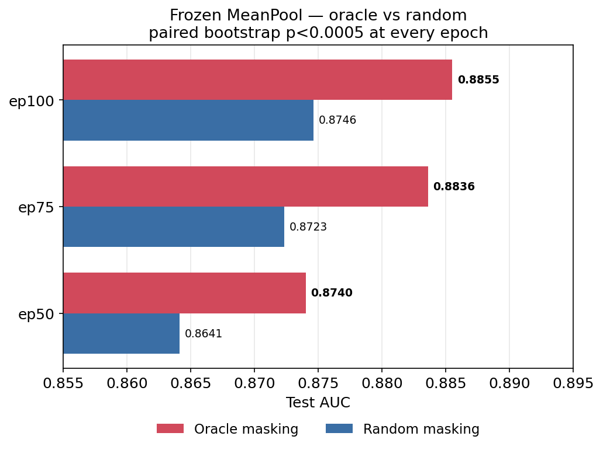

# Frozen MeanPool Sweep — Oracle anatomical (ep50/75/100)

MeanPool + Linear frozen probe across the oracle anatomical checkpoints (warm-start from random ep25, `oracle_100ep.md`). Same probe config as the random ep100 MeanPool run (Test 0.8746) for apples-to-apples. Probe is the zero-parameter ablation floor (mean over slices → LinearHead), so this reads encoder quality directly.

**Oracle sweep completed** 2026-06-07 (job `tough_malanga_dyyldrr5tn`). **Random backfill running** (job `good_dog_d8lx1wg14t`) — comparison + paired bootstrap finalized when it lands.

## Config (matches `mean_pool.md` / `d1_sweep.md`)

| Parameter | Value |
|---|---|
| Probe | MeanPool + LinearHead (0 probe params, 2.3K head) |
| Encoder | Frozen ViT-B/16 (oracle anatomical) |
| Num slices | 100 |
| Batch size | 256 |
| Epochs / patience | 50 / 15 |
| Warmup | 5 |
| LR (head) | 4e-4 |
| Weight decay | 0.05 |
| Dropout | 0.2 |
| Seed | 42 |

## Oracle results

| Checkpoint | Best epoch | Train AUC | Val AUC | Test AUC | Sensitivity | Specificity |
|---|---|---|---|---|---|---|
| ep50 | 47 | 0.8790 | 0.8544 | 0.8740 | 0.751 | 0.836 |
| ep75 | 41 | 0.8925 | 0.8624 | 0.8836 | 0.769 | 0.838 |
| **ep100** | 47 | 0.8936 | 0.8636 | **0.8855** | 0.778 | 0.842 |

Monotonic with pretraining length. Train > Val ~0.03 (mild, expected for a 2.3K-param head); Test > Val ~0.02 is a consistent FairVision val(1000)/test(3000) split property seen in every run.

## Oracle vs Random — frozen MeanPool (final)

Random backfill complete (job `good_dog_d8lx1wg14t`). **Sanity gate passed**: random ep100 reproduced 0.8746 / val 0.8559 / sens 0.761 / spec 0.838 exactly (same-seed determinism) — harness validated.

| Epoch | Random | Oracle | Δ (oracle − random) | 95% CI (paired bootstrap) | p (2-sided) |
|---|---|---|---|---|---|
| ep50 | 0.8641 | 0.8740 | +0.0099 | [+0.0051, +0.0147] | <0.0005 *** |
| ep75 | 0.8723 | 0.8836 | +0.0113 | [+0.0065, +0.0165] | <0.0005 *** |
| ep100 | 0.8746 | 0.8855 | +0.0109 | [+0.0058, +0.0162] | <0.0005 *** |

Paired stratified bootstrap, B=2000, seed 42, same resample indices for both models on the shared 3000-volume Test split (`scripts/bootstrap_frozen_meanpool.py`, method per `ablation_analysis.md`).

**The oracle advantage is significant at every epoch** — all three 95% CIs exclude zero (lower bound ≥ +0.005), p < 0.0005. The ~+0.010 gap is not single-seed noise.

**Result.** Oracle gives a consistent **+0.010–0.011 Test AUC** (≈1 point) over random at every measured epoch (ep50/75/100), p<0.0005, all 95% CIs exclude zero. A quality gain on this dataset.

Cross-check (no harness bug): random ep50 MeanPool 0.8641 = random ep50 d=1 0.8611 (`d1_sweep.md`) + the ~0.003 MeanPool offset.

## Fine-tune comparison (done)

Oracle ep100 fine-tuned beats random ep100 fine-tuned for MeanPool (+0.0079, p=0.001) and CrossAttn (+0.0065, p=0.009); d=1 +0.0023 (ns). Best overall: oracle FT MeanPool 0.8947. The FT protocol overfits (peaks ep3-4/50). See [../finetune/oracle_finetune.md](../finetune/oracle_finetune.md).
