# MIRAGE-Guided Anatomy Masking — Ablation Record

**Status:** authoritative as of 2026-08-09.
One full FairVision epoch has been run for each of three matched arms.
No downstream AUC exists for any arm.

**Branch:** `vlm-guided-masking` (merged to `main`).

> **Claim boundary.** FairVision has no anatomy ground truth. An adapter output
> that **changed** is not known to have **improved**. Only downstream AUC
> against glaucoma labels can establish improvement. All claims below are limited
> to targeting quality, efficiency, and mechanics.

---

## Contents

- [A. Method and design decisions](#a-method-and-design-decisions)
- [B. Controlled three-arm experiment](#b-controlled-three-arm-experiment)
- [C. Negative and cautionary results](#c-negative-and-cautionary-results)
- [D. Bugs found and fixed](#d-bugs-found-and-fixed)
- [E. Efficiency](#e-efficiency)
- [F. Generality across slice depth](#f-generality-across-slice-depth)
- [G. Limitations and open questions](#g-limitations-and-open-questions)
- [Adapter architecture sweep](#adapter-architecture-sweep)
- [Guardrail tests](#guardrail-tests)
- [Mask budget sweep](#mask-budget-sweep)
- [Coverage audit](#coverage-audit)
- [Historical precursors](#historical-precursors)
- [Rejected designs](#rejected-designs)
- [Corrections to earlier claims](#corrections-to-earlier-claims)
- [Reproduce](#reproduce)

---

## A. Method and Design Decisions

### Why anatomy-shaped connected targets

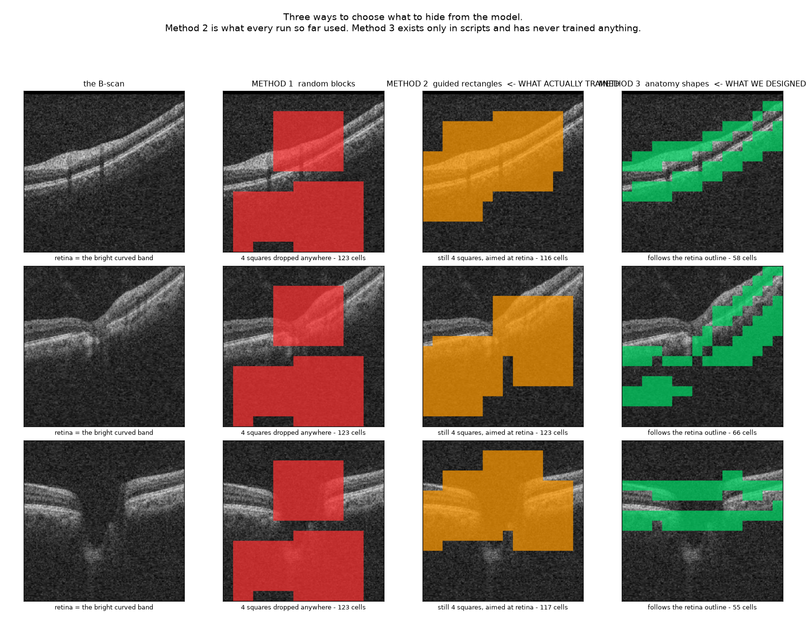

*Left: random blocks. Centre: guided rectangles (legacy). Right: anatomy-shaped
connected targets. The anatomy method places targets directly on tissue
structure rather than enclosing it in rectangles.*

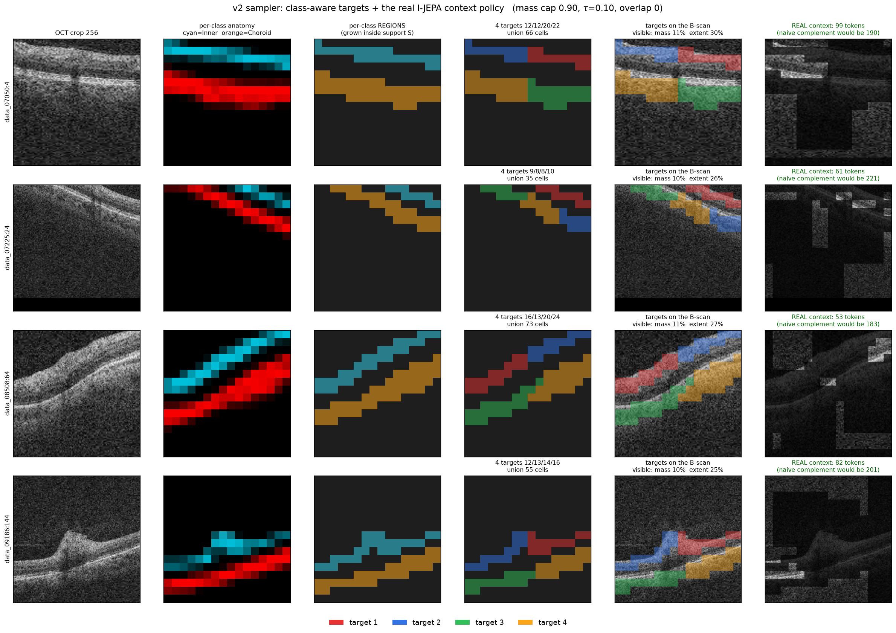

*Production anatomy sampler (v2) at `mass_cap=0.90`. Four connected targets
cover inner retina and choroid; the I-JEPA context block (orange) retains the
majority of the image.*

Anatomy is a minority of an OCT B-scan (~17.6% of grid cells). A rectangular
target wastes most of its area on vitreous/sclera. Anatomy-shaped targets
concentrate the prediction budget on tissue, leaving more context visible.
Measured over **1,000 slices** (commit 8ef247d):

| metric | RANDOM rect | ANATOMY (`mass_cap=0.90`) |
|---|---:|---:|
| target union cells | 122.6 | **53.4** |
| context after removal | 107.4 | **175.0** |
| inner retina masked | 51.6% | **82.5%** |
| dead targets (no anatomy at `tau>0.10`) | 14.12% | **2.12%** |
| inner/choroid balance ratio | 0.899 | **0.966** |

Connected shapes are required because the JEPA predictor uses positional
embeddings: a disconnected index set leaks shape information through position
rather than through learned representation (rejected design `A'`, §Rejected).

### Mass-cap sweep: why 0.90

Swept over **500 slices** with multi-component growth and the production
collator (commit 8ef247d):

| cap | target cells | inner retina masked | context tokens | zero-retina context |
|---|---:|---:|---:|---:|
| RANDOM | 122.0 | 0.516 | 107.7 | 1.00% |
| 0.80 | 46.1 | 0.725 | 181.3 | 0.80% |
| 0.85 | 50.5 | 0.774 | 177.4 | 0.80% |
| **0.90** | **55.9** | **0.825** | **172.7** | **0.80%** |
| 0.95 | 63.3 | 0.875 | 166.1 | 1.00% |
| 0.99 | 69.2 | 0.885 | 160.7 | **21.00%** |

At 0.99, zero-retina-context rate jumps to 21% — the context encoder sees no
tissue in one-fifth of batches. 0.90 is the operating point where inner-retina
coverage (82.5%) is high and context collapse is absent.

**Known cost:** at the stricter `score>0.50` threshold, 76.2% of slices have no
confident anatomy left in context at `mass_cap=0.90`, versus 2.0% for random.

### Support threshold: τ = 0.10

Standard definition of meaningful anatomy support. The void-class probability
across **25,600 cells** was `1.1e-5` (correlation with corrected score:
0.99999997), so the threshold is not contaminated by the softmax void channel.

### Target count: n = 4

Preserves the I-JEPA four-target task structure. No sweep was run over target
count; this is a compatibility decision.

### Budget lock

`build_targets_fixed_cells` holds cell count to the frozen reference guide.
This separates "the guide moved targets" from "the guide grew the task".
Measured on **192 held-out images** (commit 778791b): free budget gives 59.8
cells vs locked 47.2 from a 50.6-cell reference; mask Jaccard 0.805 (free) vs
0.737 (locked). ~26% of cells relocate in either mode.

### Adapter architecture: why cfg-7

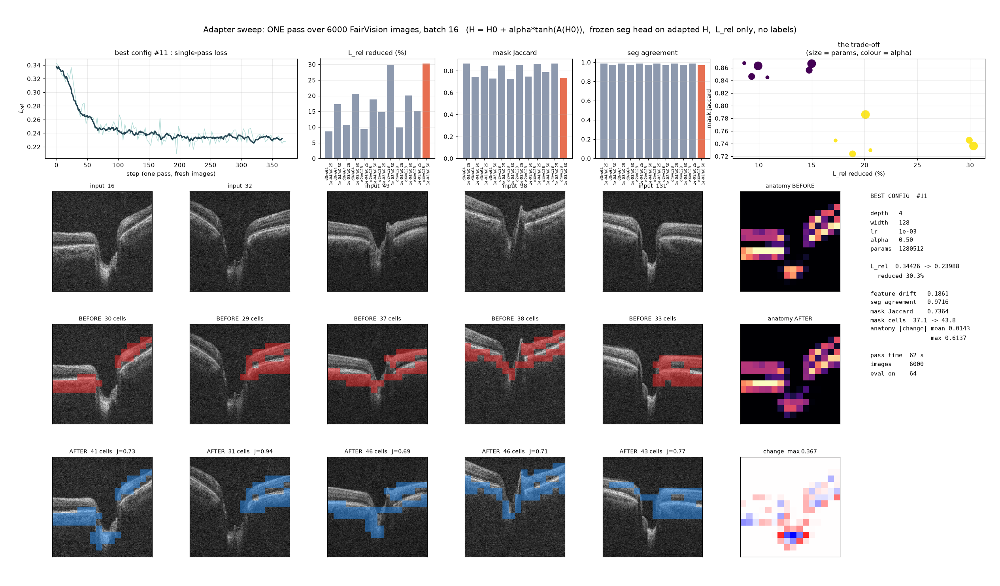

*Twelve configurations swept over one pass of 6,000 FairVision images
(375 optimizer steps). cfg-7 sits at the depth-2 knee.*

| cfg | depth | width | alpha | peak LR | params | L_rel ↓ | drift | s |
|---:|---:|---:|---:|---:|---:|---:|---:|---:|
| 3 | 0 | 64 | 0.50 | 1e-3 | 86,528 | 20.6% | 0.192 | 52 |
| **7** | **2** | **128** | **0.50** | **1e-3** | **689,664** | **29.9%** | **0.185** | **60** |
| 11 | 4 | 128 | 0.50 | 1e-3 | 1,280,512 | 30.3% | 0.186 | 62 |

Depth 0→2: +9.3 pp. Depth 2→4: +0.4 pp. The knee is at depth 2.
Alpha is the largest lever; LR second; depth third. OneCycle peak 1e-3 beats
1e-4 in every matched pair. AdamW with gradient clipping at 1.0, dropout 0.

**Selected:** cfg-7 — depth 2, width 128, alpha 0.5, OneCycle peak 1e-3,
dropout 0. 689,664 params (46% fewer than depth 4). Held-out generalisation:
29.79% vs 29.59% train (no gap, §Guardrails T1).

**Memorisation warning:** an earlier probe on **24 slices × 400 steps** reported
76.8% L_rel reduction. That was memorisation. The honest single-pass number is
29.9% (cfg-7) / 30.3% (sweep max) over 6,000 distinct images.

### Pipeline

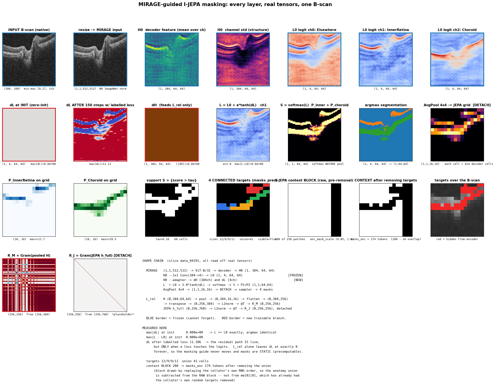

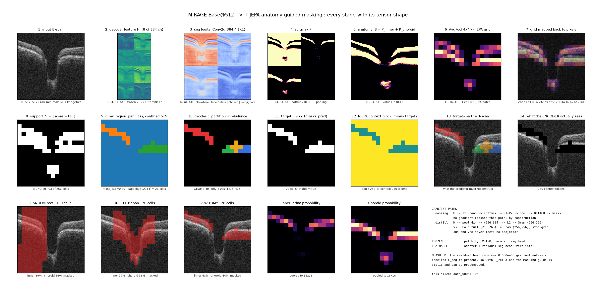

*End-to-end data flow from paired crop through MIRAGE, adapter, sampler, and
JEPA collator. Every tensor shape is annotated.*

```text
same sampled crop
├── JEPA view:   (B,3,256,256), ImageNet-normalized
└── MIRAGE view: (B,1,512,512), raw per-slice min-max

MIRAGE-Base@512 (95.6M params, ALL frozen, drop_path disabled)
  H0:                        (B,384,64,64)
  H = H0 + 0.5·tanh(A(H0)): (B,384,64,64)   [cfg-7 adapter, 689K params]
  frozen seg head:           (B,4,64,64)
  softmax → P_inner, P_choroid: (B,2,64,64)
  avg pool 4×4 → (B,2,16,16) → detach → grow + partition → 4 target indices
  MaskCollator: original context block − target union
```

The frozen seg head reads the **adapted** `H`, not raw `H0`. Routing into a
separate head was a dead end: 0.000e+00 gradient without labelled L_seg.

The mask is hard and detached: `grad_MIRAGE(L_JEPA) = 0` by construction.
Only L_rel = MSE(Gram(pool(H)), sg(Gram(h_full))) trains the adapter, where
h_full comes from the JEPA EMA target encoder.

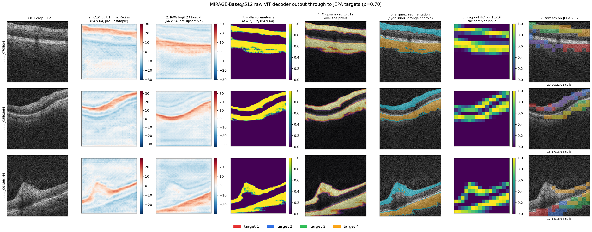

*MIRAGE score maps → grown connected regions → partitioned targets.*

---

## B. Controlled Three-Arm Experiment

One full FairVision Training epoch each: **600,000 slices, 9,375 iterations**,
identical data and seeds. Only the mask strategy differs.

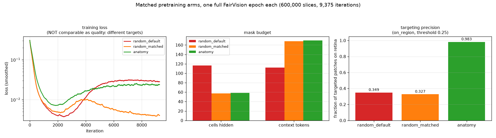

*The headline result. Left: random_default (shipped I-JEPA). Centre:
random_matched (area-matched random). Right: anatomy (MIRAGE-guided shapes).
random_matched isolates target shape from masked area.*

**Source:** `results/masking/arms/arms.json`, commit 144b938.

| Metric | random_default | random_matched | anatomy |
|--------|---:|---:|---:|
| Hidden cells | 116.8 | 57.4 | 58.6 |
| Context tokens | 112.2 | 167.8 | 169.6 |
| On-region fraction | 0.349 | 0.327 | **0.983** |
| Fallback rate | 100% | 100% | 1.7% |
| rep_diversity | 0.6727 | 0.9404 | 0.9521 |
| val_loss | 0.0293 | 0.0041 | 0.0445 |
| Seconds/epoch | 3,893 | 4,920 | 5,796 |

### Why random_matched exists

Comparing anatomy to the shipped baseline changes **both** WHERE targets land
and HOW MUCH is masked (58.6 vs 116.8 cells). Shape cannot be isolated without
an area-matched control. `random_matched` lowers `pred_mask_scale` to
0.055–0.075, matching anatomy's hidden count (57.4 vs 58.6) and context
(167.8 vs 169.6) to within 2%. The only remaining variable is target
placement.

**Result:** at matched budget, anatomy places **3.0×** more targets on retina
(98.3% vs 32.7%) with a 1.7% fallback rate.

### The anatomy run's starting point

The anatomy arm warm-starts from `resume-ep27.pth.tar` (epoch 27, loss 0.11894,
random-masked bootstrap). It therefore measures what anatomy guidance adds
**on top of** a random-masked foundation, not anatomy from random init.

---

## C. Negative and Cautionary Results

### C1. rep_diversity is not a collapse metric for OCT

Retina occupies only **17.6%** of grid cells. 97% of tile-pairs involve at least
one background tile, so the all-pairs mean is dominated by background.

| Partition | Cosine similarity |
|-----------|---:|
| All pairs | 0.3297 |
| Background–background | 0.3293 |
| Retina–retina | 0.4886 |
| Retina–background | 0.3131 |

**Source:** `results/masking/arms/arms.json`, commit 5ed437d.

The **untrained** encoder has the LARGEST retina/background gap (0.0851) versus
trained encoders (0.0155–0.0287), because raw pixel brightness already separates
vitreous from tissue before any learning.

The matched control overturns the naive reading: anatomy (0.9521) vs baseline
(0.6727) looks like anatomy causes collapse, but random_matched is 0.9404.
The effect tracks the **masking ratio** (masking 21% vs 46% of the image), not
target shape. Anatomy adds only +0.012 over its proper control.

### C2. Validation loss is inverted versus targeting quality

| Arm | val_loss | on-region |
|-----|---:|---:|
| random_matched | **0.0041** (best) | 0.327 (worst) |
| anatomy | **0.0445** (worst) | 0.983 (best) |

A method predicting mostly-background patches gets trivially low loss. Retina
is high-variance and harder to predict. **Validation loss cannot rank masking
strategies.** Only downstream AUC can.

### C3. One epoch from random init is too early

The three arms ran one epoch each. This demonstrates targeting mechanics and
engineering correctness, not that anatomy masking produces a better encoder.
No representation-quality conclusion is drawn.

---

## D. Bugs Found and Fixed

### D1. global_min_pred collation (commit 765efbf, 0f1ab43)

The collator's `global_min_pred` truncation keeps the minimum target size
across the entire microbatch, destroying ragged anatomy targets.

| Metric (batch 64, 981 slices) | Value |
|---|---:|
| Target area retained | **7.2%** |
| K=1 in batch | **99.8%** |
| P(1-cell target in batch) | 99.7% |

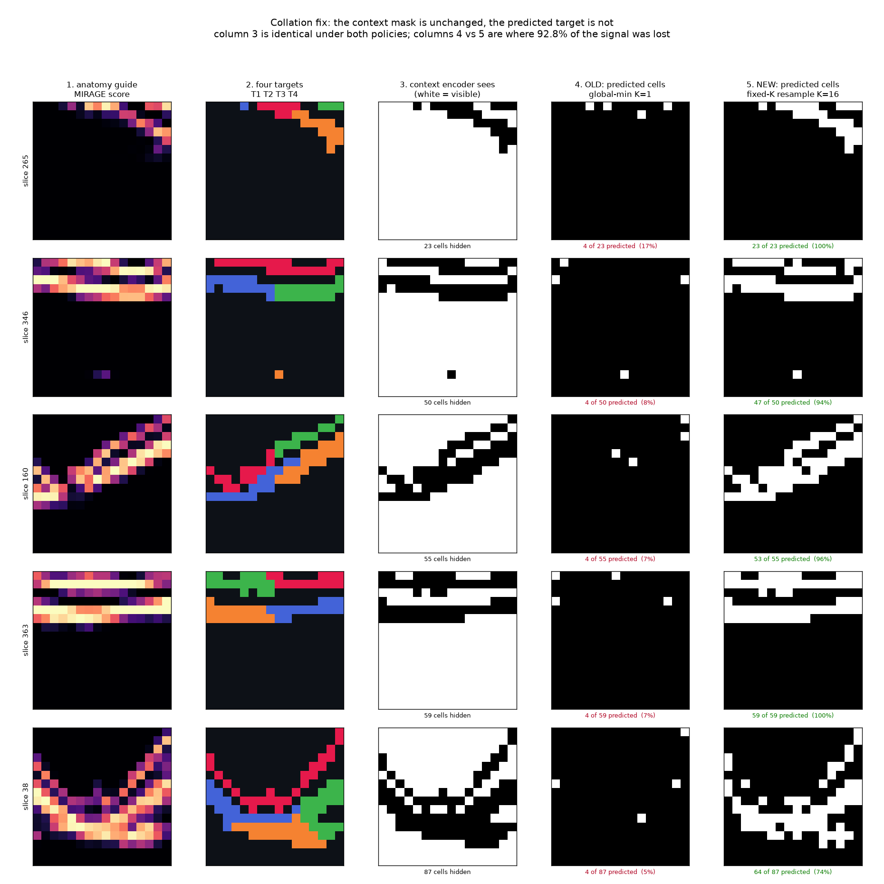

*Left: truncated targets retain only 4 of 55.7 cells. Right: fixed-K K=16
resampling retains 51.3 cells (92.0% of ideal).*

**Front-slicing spatial bias:** truncation kept the FIRST K indices in raster
order, biasing survivors to the top-left:

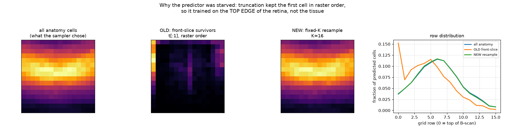

*The survivor distribution concentrates at the ILM/vitreous interface — a
high-contrast edge trivially predictable from context.*

| Metric | All targets | Old (truncated) | New (resampled) |
|--------|---:|---:|---:|
| Mean row | 6.18 | 4.50 | 6.13 |
| Leftmost-3-column share | 18.6% | 36.0% | 18.6% |

**Source:** `results/masking/collation/why_starved.json`, commit 0f1ab43.

**Fix:** fixed-K resampling (K=16 chosen at 92.0% retention, 19.9% repeated
slots — the knee). Connectivity preserved by `shrink_to_k` (breadth-first
connected subset): 231/256 → **256/256** single-component. The later
fallback-path variant achieved 233/256 → 256/256.

| Policy | Distinct cells | % of ideal |
|--------|---:|---:|
| Ideal | 55.7 | 100% |
| global_min (batch 64) | 4.0 | 7.2% |
| Bucketing | 36.8 | 66.0% |
| **Fixed-K K=16** | **51.3** | **92.0%** |

### D2. Sampler bug A — single-component growth (commit 8ef247d)

`grow_region()` seeded at the global maximum and could only fill that seed's
connected component. Over **1,982 class-regions**: 5.8% of mass stranded in
unreachable components; cap bound on only 18.9% of regions (81.1% stopped by
component exhaustion).

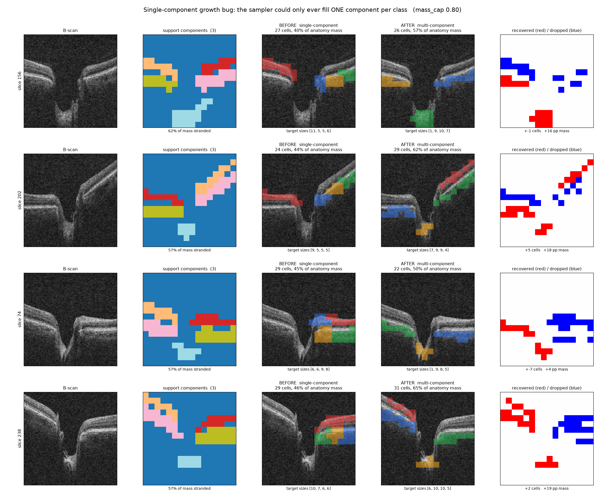

*Four ONH slices where the retinal band splits. Before: one fragment captured.
After: all fragments grown under shared budget.*

### D3. Sampler bug B — orphaned components (commit 8ef247d)

8.4% of slices had >4 connected components; surplus regions were orphaned after
growth. Mean capacity discarded 28.6% (max 93.1%). Fix: per-class component cap
at n=4, budget redistributed. After: 0.27% mean / 15.4% max loss.

### D4. Guided-rectangle overlap (commit fc49f61)

Overlap 40.5% against a declared tolerance of 0.25; random was only 28.9%.
Fix A (least-overlap window): 40.5% → 36.1%. Residual is geometrically forced:
4 targets × 41 cells × 0.40 fill needs 65.7 anatomy cells but only 45.6 exist.
Fix B (matched scale): → **8.0%**.

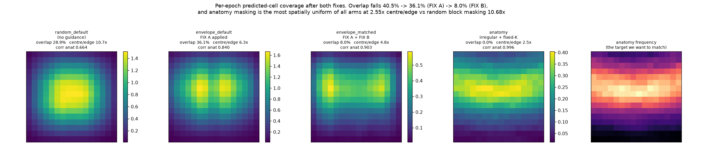

*Overlap progression: 40.5% (original) → 36.1% (least-overlap) → 8.0%
(matched scale). The anatomy arm has 0% overlap by construction.*

### D5. The ramp trap (commit fc49f61)

`T_warm=25` means `r_t=0` for the first 25 epochs, so every probe that omitted
`set_epoch` silently measured **random masking** while reporting anatomy.
The production config's first 25/100 epochs trained random masking by design.

### D6. MIRAGE was not actually frozen (commit c6d33c0)

`build_mirage()` returned `.eval()` but left 95,374,852 / 95,571,460 params
(99.8%) with `requires_grad=True`. Safe only via `no_grad()` wrapping.
Additionally, `drop_path_rate=0.1` made it stochastic: train-vs-eval logit
swing of **1.545e+01**; two identical forwards differed by **1.428e+01**.
Fix: explicit freeze (0 trainable) + drop_path disabled at source (bitwise
identical in train and eval: 0.000e+00 diff).

---

## E. Efficiency

### Timing decomposition (commit 144b938)

| Transition | Δ seconds | Cause |
|---|---:|---|
| random_default → random_matched | +1,027 | Context grows 112→168 tokens (encoder work) |
| random_matched → anatomy | +876 | The anatomy sampler |

The sampler costs ~15% of total epoch time, not the naive 49%
((5796−3893)/3893). The majority is the price of larger context.

`is_viable` costs **18.89 ms/img** and duplicates `build_targets`'
**14.24 ms/img** — a redundant check that should be merged.

### Guide cache (commit 7d0d7f9)

| Property | Value |
|---|---|
| Volumes / slices | 6,000 / 600,000 |
| Build time | 3,941 s (66 min) |
| Size (compressed) | 3.85 GiB |
| Schema | v2: `[100, 2, 200, 200]` uint8, P_inner + P_choroid |
| Max diff vs live | 1 uint8 level (AMP rounding) |
| Adapter SHA | 3186b1fa278bc97f |
| MIRAGE SHA | 82e5a0dd09b6bd58 |

**Source:** `results/masking/precompute/precompute_verification.json`.

**Post-softmax at native 200×200** is mandatory. Pool-then-softmax was measured
at Jaccard 0.587, 0/200 identical masks, −40% cells. The guide is cropped with
the image before pooling to 16×16.

**Why NOT cache H0:** (384, 64, 64) fp16 = 3.00 MiB/sample → **1.72 TiB** for
the full dataset, and features cannot be validly cropped after encoding (crop
must precede the encoder).

### fp32 downstream VRAM (commit 376665d)

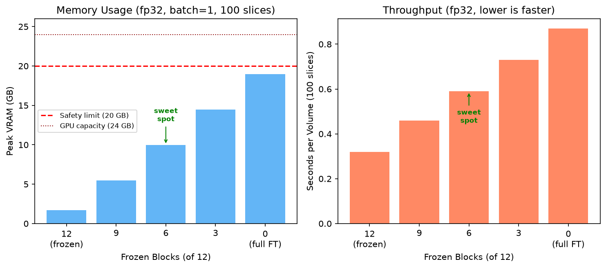

*Peak VRAM by evaluation mode. Full fine-tune exceeds 24 GB for >1 volume.*

**Bug found:** `precompute_features()` called `autocast()` unconditionally. All
prior downstream evaluations were fp16, not fp32.

| Mode | Peak MB | Speed |
|---|---:|---:|
| Frozen probe (chunk=100, 1 vol) | 1,653 | 0.32 s/vol |
| Full fine-tune (batch=1, 100 slices, accum=4) | 18,975 | 0.87 s/vol |
| Partial FT (freeze 6/12 blocks) | 9,961 | 0.59 s/vol |

Full fine-tune >1 volume on 24 GB: Windows silently spills to host RAM (no OOM,
crawls). Gradient checkpointing not available in `src/models/vision_transformer.py`.

**Source:** `results/masking/vram/fp32_downstream.json`.

---

## F. Generality Across Slice Depth

Cfg-7 validated on slices spanning the full volume depth, not just the
middle-of-ONH B-scan (commit c6d33c0):

| Arm | L_rel reduction | Drift |
|---|---:|---:|
| Middle-slice only | 29.90% | 0.1811 |
| Stratified (full depth) | 26.18% | 0.1745 |

Per-depth-band spread: only **3.52 pp** (min 24.54% at band 160–200, max
28.06% at band 80–120). No peripheral cliff.

**Source:** `results/masking/slice_pos/slice_pos.json`, `depth_profile.json`.

**Caveat:** the 27.7/30.7/32.5% saturation figures reported elsewhere come from
the middle-slice cache and are not directly comparable to the 26.18% stratified
figure.

---

## G. Limitations and Open Questions

| Limitation | Status |
|---|---|
| **No downstream AUC measured** for any anatomy arm | Existing AUCs (0.8746/0.8807/0.8855) come from the PRIOR rectangle-placement programme |
| **No checkpoints saved** from the three matched arms | `save_every` defaulted to 25; only 1 epoch was run (fixed to 5 in production config) |
| **One epoch is too early** to judge representation quality | Arms demonstrate mechanics, not encoder improvement |
| **FairVision has no anatomy ground truth** | "Changed" ≠ "improved"; only downstream AUC can establish improvement |
| **Anatomy arm warm-starts from ep27** | Measures anatomy ON TOP of a random-masked bootstrap, not anatomy from scratch |
| **rep_diversity is unreliable** for OCT (§C1) | No validated replacement collapse metric exists |
| **The two-class soft guide is wired** (commit a904bfd) but not trained | All reported arms used the merged single-class envelope |

---

## Adapter Architecture Sweep

Full 12-configuration table from the **6,000-image** one-pass sweep (commit
778791b, `results/masking/adapter_sweep/sweep.json`):

| cfg | depth | width | peak LR | alpha | params | L_rel ↓ | feature drift | seg agreement | mask Jaccard | s |
|---:|---:|---:|---:|---:|---:|---:|---:|---:|---:|---:|
| 0 | 0 | 64 | 1e-4 | 0.25 | 86,528 | 8.6% | 0.093 | 0.988 | 0.867 | 50 |
| 1 | 0 | 64 | 1e-4 | 0.50 | 86,528 | 17.3% | 0.187 | 0.975 | 0.745 | 49 |
| 2 | 0 | 64 | 1e-3 | 0.25 | 86,528 | 10.8% | 0.095 | 0.987 | 0.845 | 51 |
| 3 | 0 | 64 | 1e-3 | 0.50 | 86,528 | 20.6% | 0.192 | 0.973 | 0.730 | 52 |
| 4 | 2 | 128 | 1e-4 | 0.25 | 689,664 | 9.3% | 0.054 | 0.988 | 0.846 | 57 |
| 5 | 2 | 128 | 1e-4 | 0.50 | 689,664 | 18.9% | 0.116 | 0.976 | 0.724 | 57 |
| 6 | 2 | 128 | 1e-3 | 0.25 | 689,664 | 14.8% | 0.092 | 0.985 | 0.856 | 56 |
| **7** | **2** | **128** | **1e-3** | **0.50** | **689,664** | **29.9%** | **0.185** | **0.971** | **0.745** | **60** |
| 8 | 4 | 128 | 1e-4 | 0.25 | 1,280,512 | 9.9% | 0.060 | 0.988 | 0.863 | 61 |
| 9 | 4 | 128 | 1e-4 | 0.50 | 1,280,512 | 20.1% | 0.131 | 0.976 | 0.786 | 62 |
| 10 | 4 | 128 | 1e-3 | 0.25 | 1,280,512 | 15.0% | 0.093 | 0.985 | 0.866 | 62 |
| 11 | 4 | 128 | 1e-3 | 0.50 | 1,280,512 | 30.3% | 0.186 | 0.972 | 0.736 | 62 |

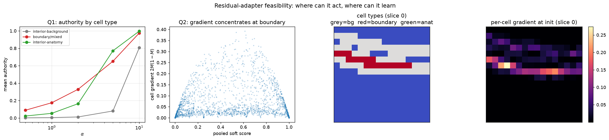

*Feasibility analysis: adapter residual magnitude vs MIRAGE logit scale. The
tanh-bounded residual (alpha=0.5) cannot overwhelm the frozen head's confident
predictions.*

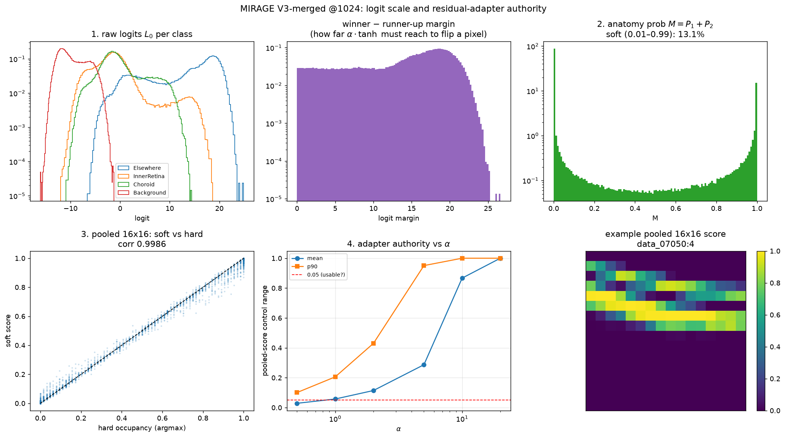

*Distribution of MIRAGE logit magnitudes. Most cells are saturated (margin
≥0.9), limiting the adapter's effective influence to boundaries.*

---

## Guardrail Tests

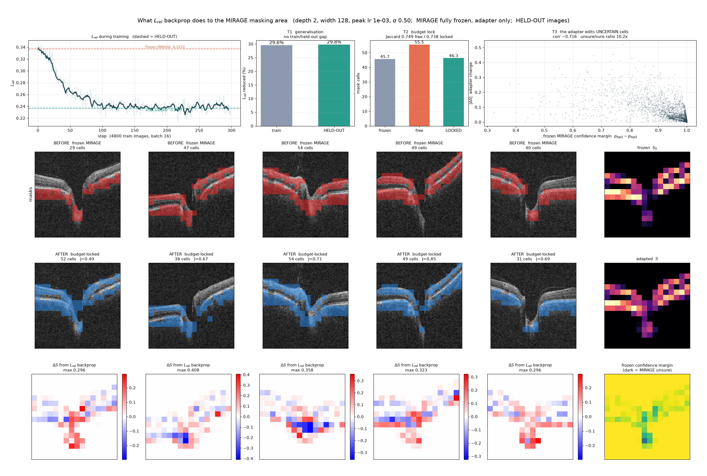

*Cfg-7 trained on 4,800 images, evaluated on disjoint 1,200. Reported metrics
use 192 sampled images per split.*

### T1 — Held-out generalisation

| Split | L_rel before | L_rel after | Reduction | Drift | Seg agreement |
|---|---:|---:|---:|---:|---:|
| Train (192) | 0.33636 | 0.23684 | 29.59% | 0.181 | 0.971 |
| Held-out (192) | 0.33719 | 0.23673 | 29.79% | 0.182 | 0.971 |

No generalisation gap. The adapter learned a repeatable transformation.

### T2 — Budget lock

| Guide | Mean cells | Jaccard vs frozen |
|---|---:|---:|
| Frozen | 50.6 | 1.000 |
| Adapted, free | 59.8 | 0.805 |
| Adapted, locked | **47.2** | **0.737** |

Locking removes expansion; ~26% of cells still relocate.

### T3 — Where the adapter acts

| Statistic | Value |
|---|---:|
| corr(\|Δscore\|, margin) | **−0.7159** |
| Uncertain cells (margin <0.5) | 0.2% |
| Mean \|Δ\| at uncertain cells | 0.14307 |
| Sure cells (margin ≥0.9) | 90.2% |
| Mean \|Δ\| at sure cells | 0.01399 |
| Uncertain/sure change ratio | **10.2×** |

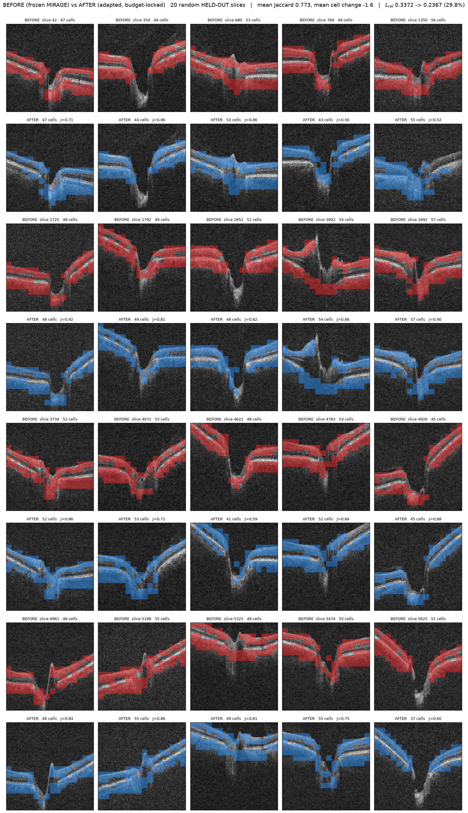

*Budget-locked mask Jaccard averages 0.773 (range 0.52–0.96) across 20
held-out slices.*

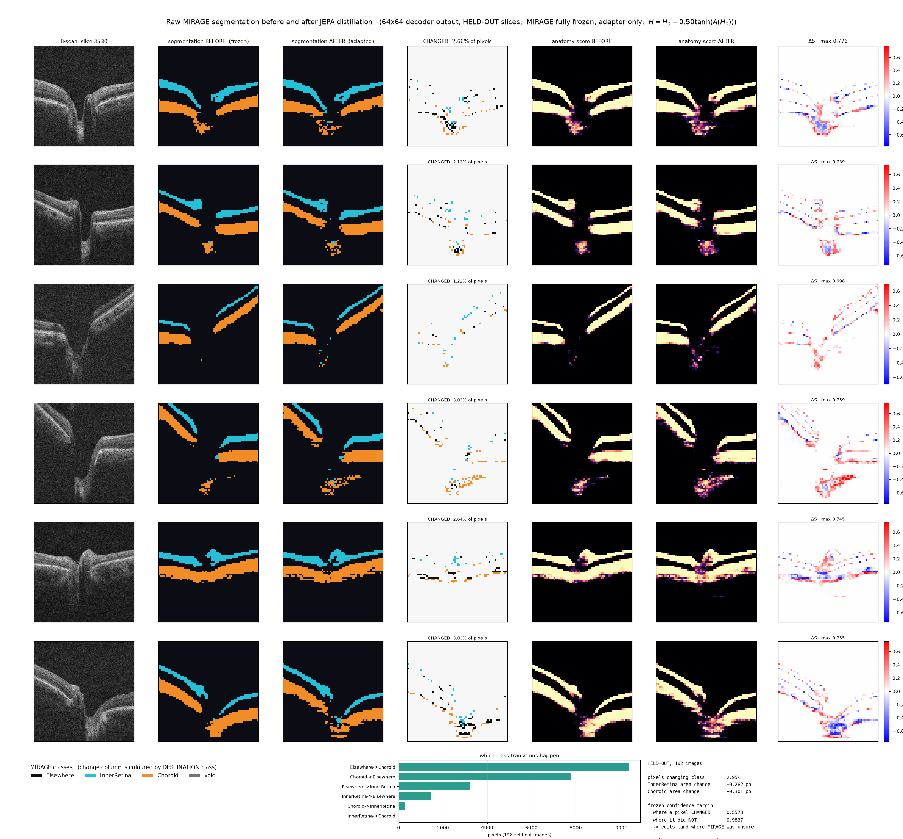

*Demonstrates change, not improvement — no FairVision anatomy labels exist.*

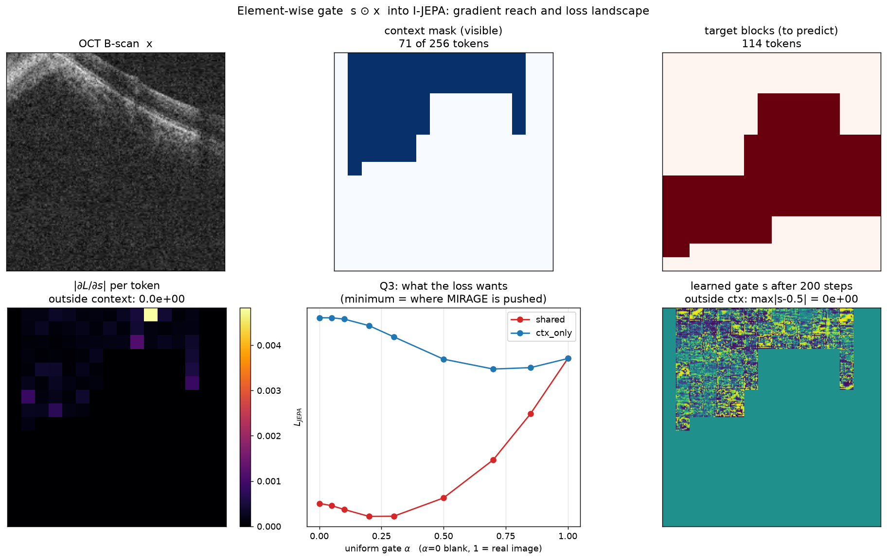

*The element-wise gate probe confirms `dL/ds = 0` for all target-excluded
patches (1,360 measured). Gradient does not flow through the hard mask.*

---

## Mask Budget Sweep

### Full table (500 slices, commit 8ef247d)

| cap | target cells | anatomy mass | dead diag | inner masked | context | retina-in-ctx | zero-retina ctx |
|---|---:|---:|---:|---:|---:|---:|---:|
| RANDOM | 122.0 | 0.556 | 2.40% | 0.516 | 107.7 | 25.1 | 1.00% |
| 0.80 | 46.1 | 0.758 | 0.46% | 0.725 | 181.3 | 25.6 | 0.80% |
| 0.85 | 50.5 | 0.808 | 0.46% | 0.774 | 177.4 | 21.7 | 0.80% |
| **0.90** | **55.9** | **0.858** | **0.46%** | **0.825** | **172.7** | **17.0** | **0.80%** |
| 0.95 | 63.3 | 0.909 | 0.46% | 0.875 | 166.1 | 10.4 | 1.00% |
| 0.99 | 69.2 | 0.907 | 0.46% | 0.885 | 160.7 | 5.0 | 21.00% |

### Class balance (1,000 slices, commit 778791b)

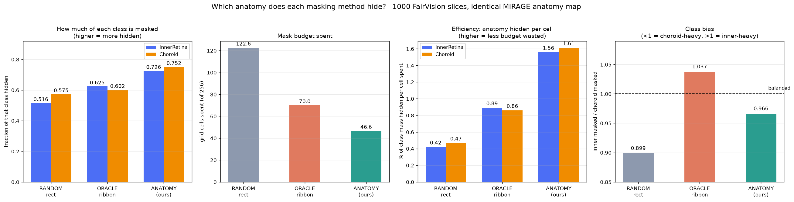

*Anatomy is near-balanced (0.966 inner/choroid); random is the most
choroid-biased (0.899).*

| Method | Target cells | Inner eff. | Choroid eff. |
|---|---:|---:|---:|
| RANDOM | 122.6 | 0.42 | 0.47 |
| ORACLE | 70.0 | 0.89 | 0.86 |
| ANATOMY | 46.6 | **1.56** | **1.61** |

Efficiency = fraction of class mass hidden per cell spent. Anatomy is 3.7×
more efficient than random for inner retina.

### Dead targets (1,000 slices × 4 = 4,000 targets)

| | RANDOM | ANATOMY+fallback |
|---|---:|---:|
| Dead targets | 14.12% (565) | **2.12%** (85) |

6.7× fewer dead targets.

---

## Coverage Audit

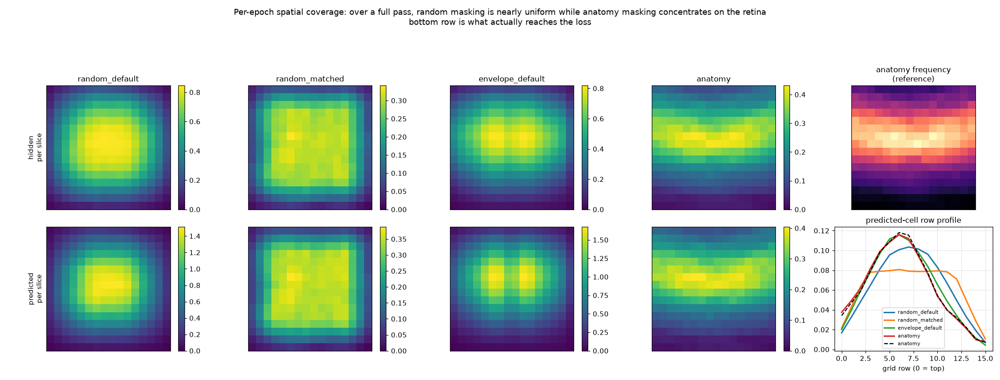

*Coverage heatmaps for each arm over 1,000 slices. Random block masking has a
10.68× centre-vs-edge bias (inherited from I-JEPA's `_sample_uniform_location`).
Anatomy masking is the most spatially uniform arm (2.55×).*

**Source:** `results/masking/coverage/`, commit fc49f61.

| Issue | Finding | Status |
|---|---|---|
| Centre-vs-edge bias | 10.68× for blocks, 2.55× for anatomy | Design (inherited from I-JEPA) |
| Guided-rect overlap | 40.5% → 36.1% → 8.0% | Fixed |
| Deep-layer under-coverage | Choroid 0.48×, sclera 0.39× vs random | Acceptable (glaucoma targets RNFL + choroid) |
| Ramp gate (T_warm) | Probes measured random while claiming guided | Fixed (assert r_t > 0) |

Spatial correlation with anatomy frequency: random 0.664, envelope 0.840,
envelope-matched 0.903, **anatomy 0.996** (commit fc49f61).

---

## Historical Precursors

### Legacy MIRAGE-envelope arm (rectangle placement)

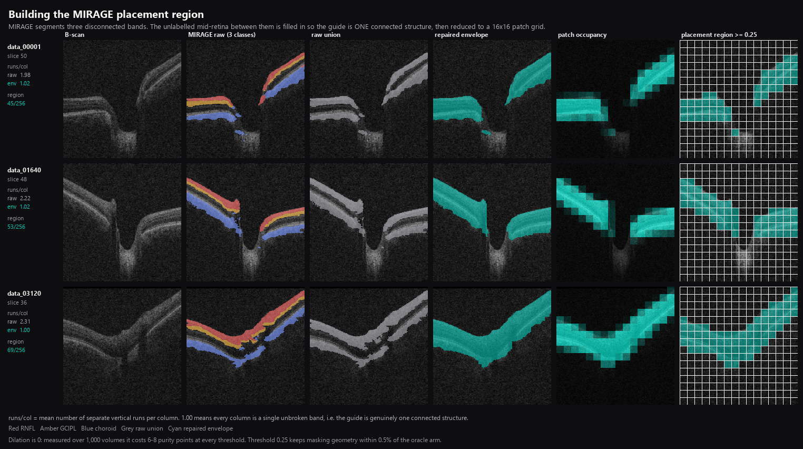

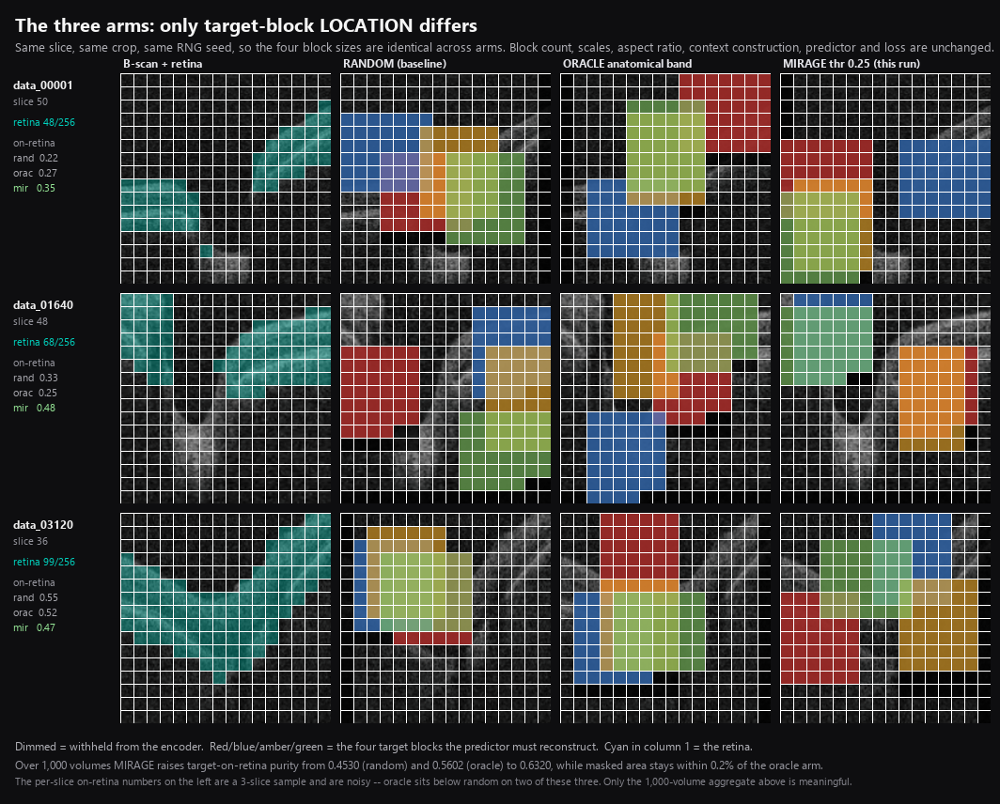

Policy sweep over **1,000 volumes / 19,987 slices**:

| Method | Target purity | Unique cells | Context |
|---|---:|---:|---:|
| RANDOM | 0.4530 | 112.4 | 107.6 |
| ORACLE | 0.5602 | 101.9 | 116.6 |
| MIRAGE envelope | **0.6320** | 101.7 | 117.2 |

Downstream AUC (FairVision Test, **3,000 volumes**, frozen MeanPool ep100):

| Arm | AUC |
|---|---:|
| random | 0.8746 |
| MIRAGE envelope | 0.8807 |
| **oracle** | **0.8855** |

Mask purity was not a validated proxy for downstream AUC.

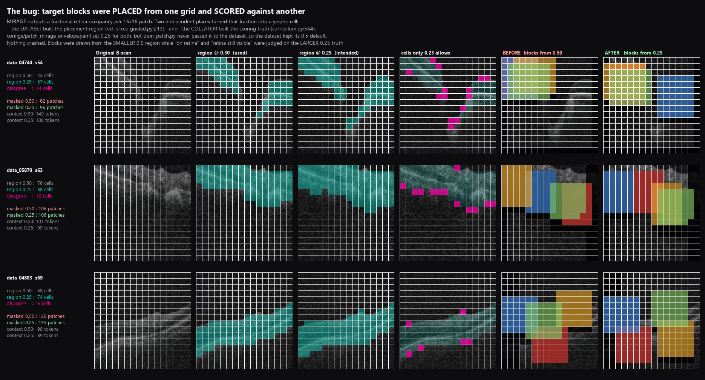

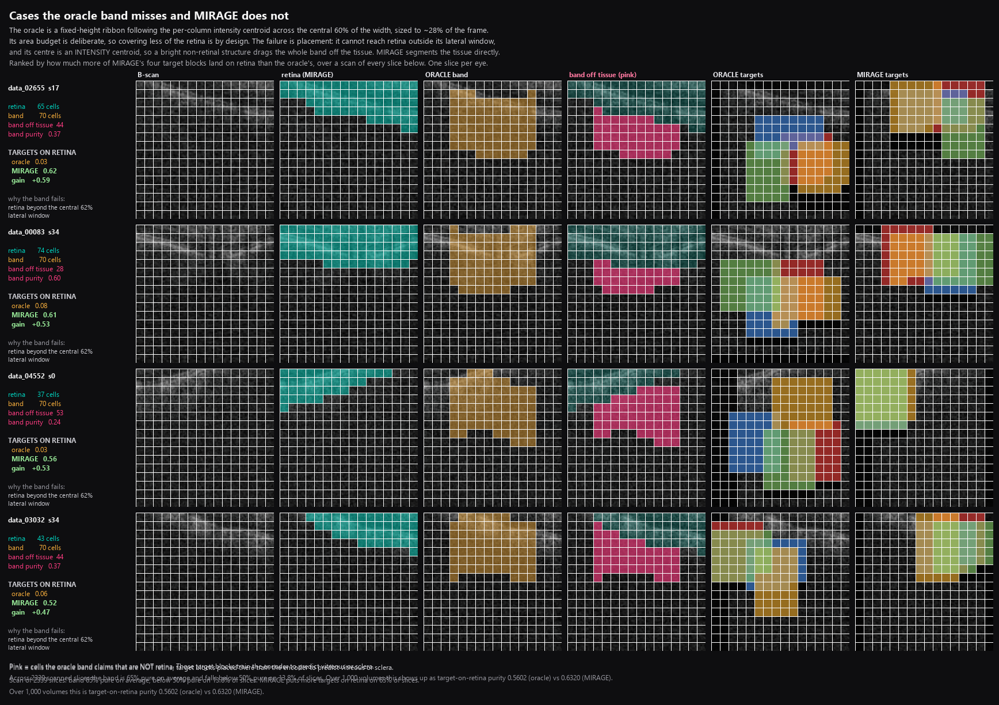

### v1 adapter pipeline

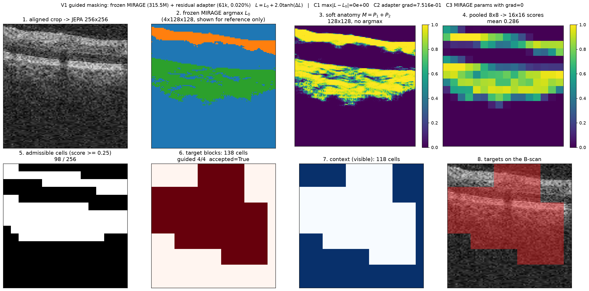

*The original v1 adapter routing (before the dead-head finding). Retained for
historical reference.*

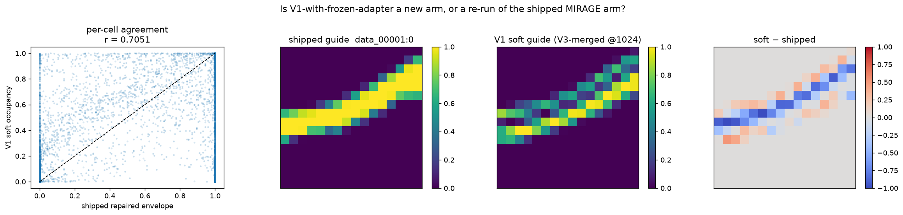

*Verified that the v1 guide matches the production envelope within rounding.*

### Phase-1 masking investigation

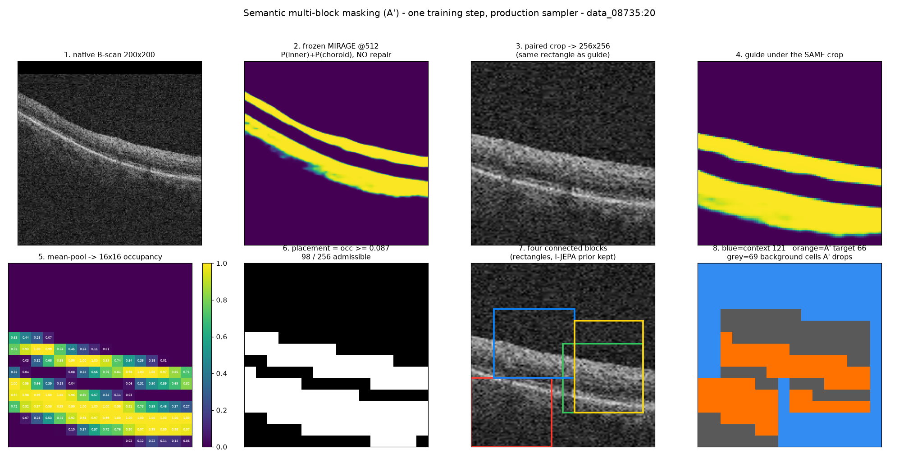

*Early-stage masking demonstrations before the anatomy sampler existed.*

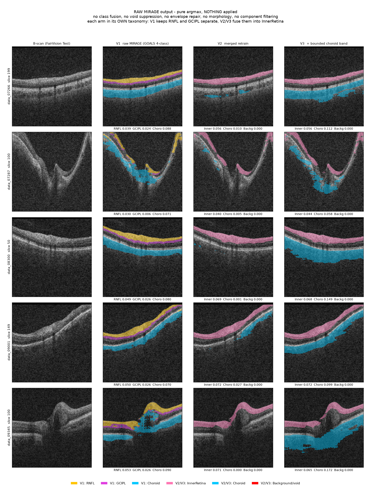

*Argmax of MIRAGE logits at native 200×200 resolution.*

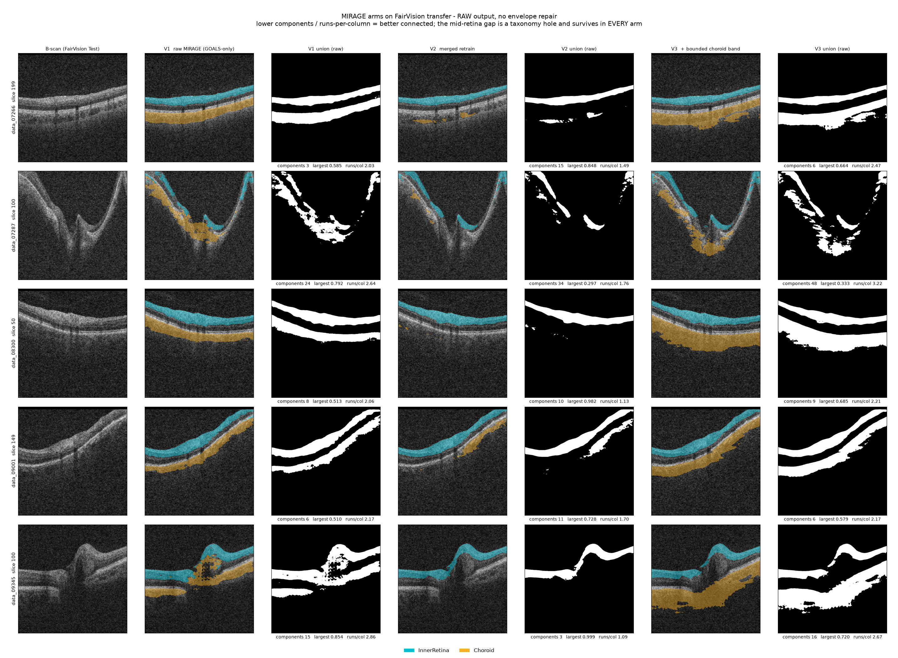

*Evolution of mask computation: v1 (binary envelope), v2 (two-class soft), v3
(connected anatomy shapes).*

### JEPA-error scorer — geometric confound

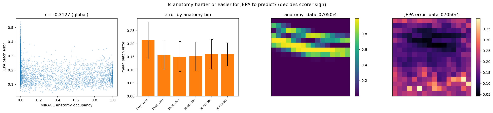

*Over 20 slices: error correlates with distance to context centroid (+0.57),
not anatomy (−0.27). After controlling for distance and intensity, partial
correlation with anatomy is +0.04.*

### JEPA-teacher sensitivity (circular)

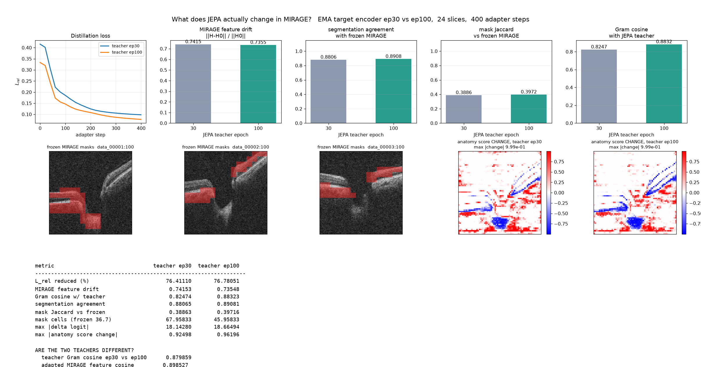

*Both teachers came from MIRAGE-guided runs. The probe is circular:
sensitivity evidence only.*

---

## Rejected Designs

| Design | Measurement | Decision |
|---|---|---|
| **D1 pixel-level gate `s*x`** | 1,360 patches: `dL/ds=0` for all; 200 Adam steps: `max(\|s−0.5\|)=0` | Rejected: no gradient where selection is needed |
| **D2 token gate + ST top-k** | 20 slices, 4 temps, 600 steps: always favors easy targets | Rejected |
| **D3 detached hard mask** | `grad_MIRAGE(L_JEPA)=0` by construction | Accepted |
| **Separate residual logit head** | 0.000e+00 gradient; seg agreement and Jaccard both 1.000000 | Dead end |
| **Extent-based budget** | Coverage changed by 0.001–0.011; unconstrained consumed 255/256 cells | Rejected |
| **Rank-cut geodesic** | 29.7% of 300 slices disconnected | Rejected |
| **Largest-to-smallest rebalance** | Size spread 3.54, chain formation (300 slices) | Rejected |
| **Constrained projector for L_sem** | 233% feature churn, 0.0% gain (40 slices, 400 steps) | Rejected |
| **Direct A' intersection** | 58.9 vs 123.8 cells; ~19% empty-batch risk | Rejected |
| **JEPA-error scorer** | Distance correlation +0.57 dominates anatomy −0.27 (20 slices) | Rejected |

---

## Corrections to Earlier Claims

| Earlier statement | Correction | Source |
|---|---|---|
| default `mass_cap=0.80` | **Superseded.** 500-slice sweep selects 0.90. | 8ef247d |
| old cap-sweep tables | **Superseded.** Predated multi-component growth. | 8ef247d |
| "residual head gets zero gradient → guide is static" | **Wrong wiring.** Frozen head must read adapted H; 192-image held-out: agreement 0.9705, Jaccard 0.7365. | 778791b |
| "76.8% L_rel reduction" | **Memorisation.** 24 slices × 400 steps. Honest: 29.9% over 6,000 images. | c6d33c0 |
| "I-JEPA scattered 54.2→19.2" | **Wrong table reading.** Correct: random patches 17.6 vs multi-block 54.2. | 778791b |
| "L_sem is harmful" | **Wrong.** 40-slice probe: gradient cosine −0.076, agreement 0.9999. Ineffective, not harmful. | 778791b |
| "ViT-L interpolates positional embeddings" | **Wrong.** Neither checkpoint did so. | 778791b |
| "57.6–89.3% of gradient reaches MIRAGE" | **Wrong label.** Those were L_rel reduction, not gradient share. | 778791b |
| "anatomy context diluted: 48.7% vs 58.3%" | **Indexing bug.** Fixed: 58.7% vs 57.9%. | 778791b |
| "84.2 context tokens" | **Incomplete.** Post-truncation batch-8; per-image is ~100–105. | 778791b |
| `p.grad is None` proves MIRAGE detached | **Wrong test.** Check `H.grad_fn is None`. | c6d33c0 |
| dropout makes masks stochastic | **Measured false.** Jaccard 1.0000 in train/eval (with drop_path=0.1 but EVAL mode). | c6d33c0 |
| void class invalidates anatomy score | **Overstated.** 25,600 cells: void prob 1.1e-5, corr 0.99999997. | 778791b |
| anatomy is choroid-biased | **Wrong for current sampler.** Random is worst (0.899); anatomy is 0.966. | 778791b |
| changed MIRAGE outputs = better segmentation | **Not supported.** No FairVision anatomy labels. Report change only. | 778791b |
| `jepa_to_mirage` shows JEPA improved MIRAGE | **Circular.** Teachers came from MIRAGE-guided run. | 778791b |
| B-1: "15.3% retained, K=1 in 69.2%" | **Revised.** Re-measured after growth fixes: 7.2% retained, K=1 in 99.8%. | c6d33c0 |
| MIRAGE was frozen | **Not actually.** 99.8% of params had requires_grad=True; safe only via no_grad wrapping. | c6d33c0 |

---

## Additional Figures

### Sampler demonstrations

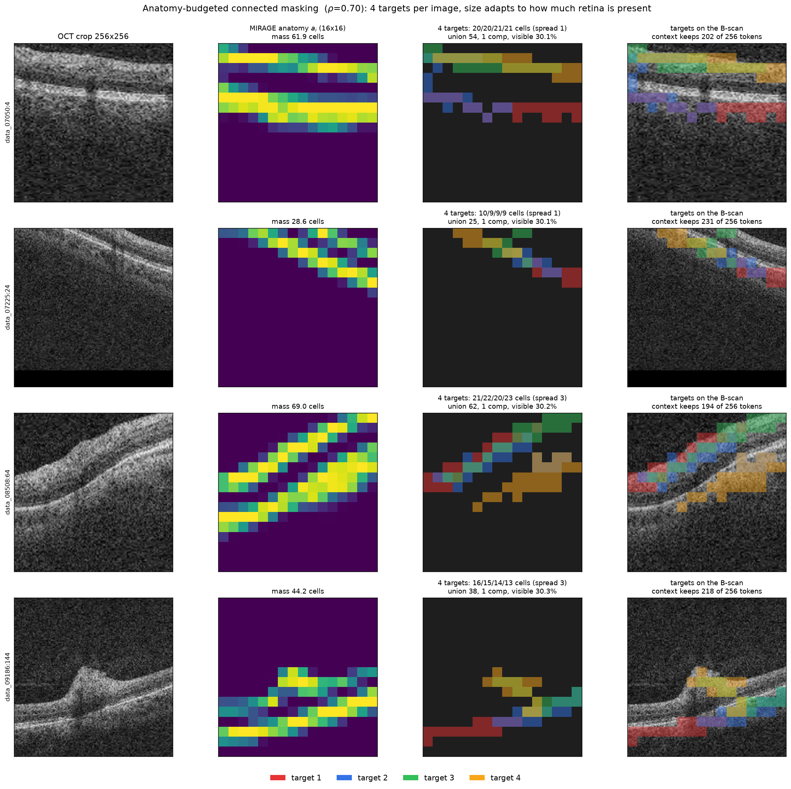

*Multiple real B-scans with anatomy-shaped targets overlaid. Targets follow
tissue structure rather than rectangular bounding boxes.*

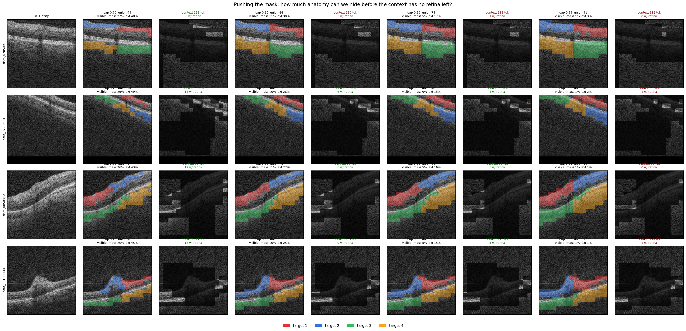

*Pressure (cells demanded vs cells available) across slices. High pressure
triggers the random fallback path.*

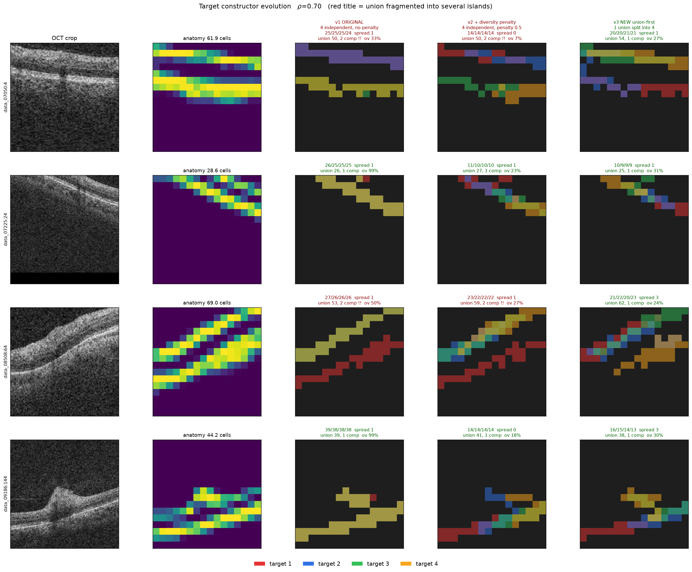

*Side-by-side comparison of random blocks, guided rectangles, and anatomy
shapes on identical slices.*

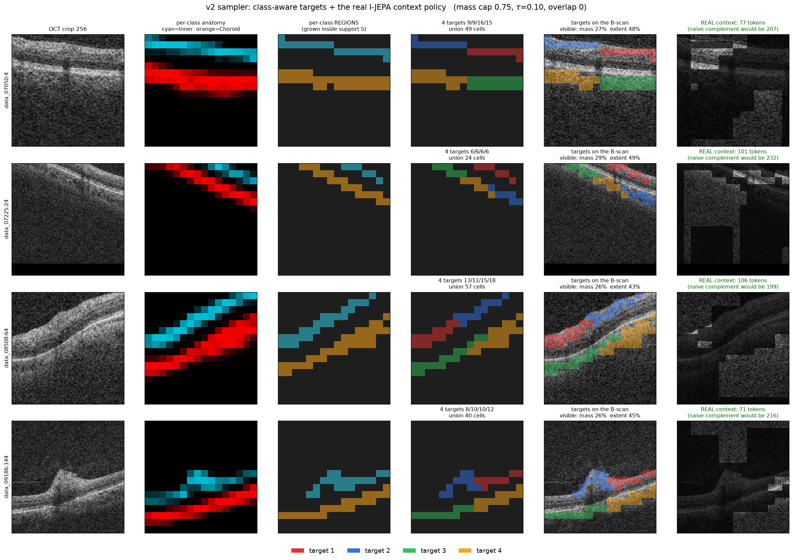

*The v2 sampler operating on a batch of real slices.*

### Dataset samples

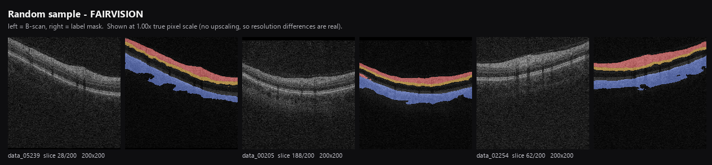
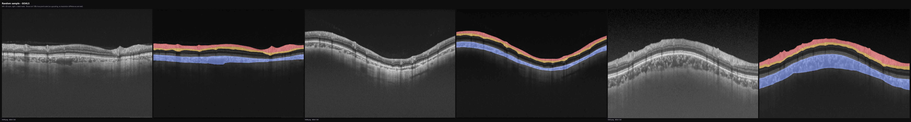
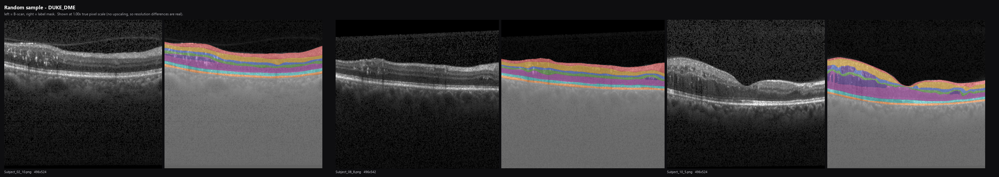
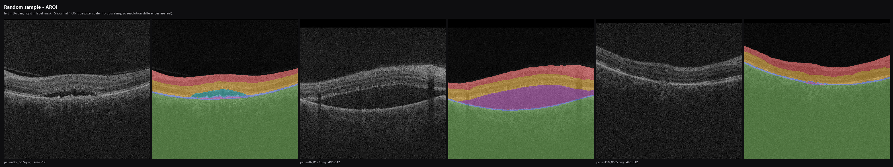

*Representative B-scans from each dataset used in the programme.*

### Other supporting figures

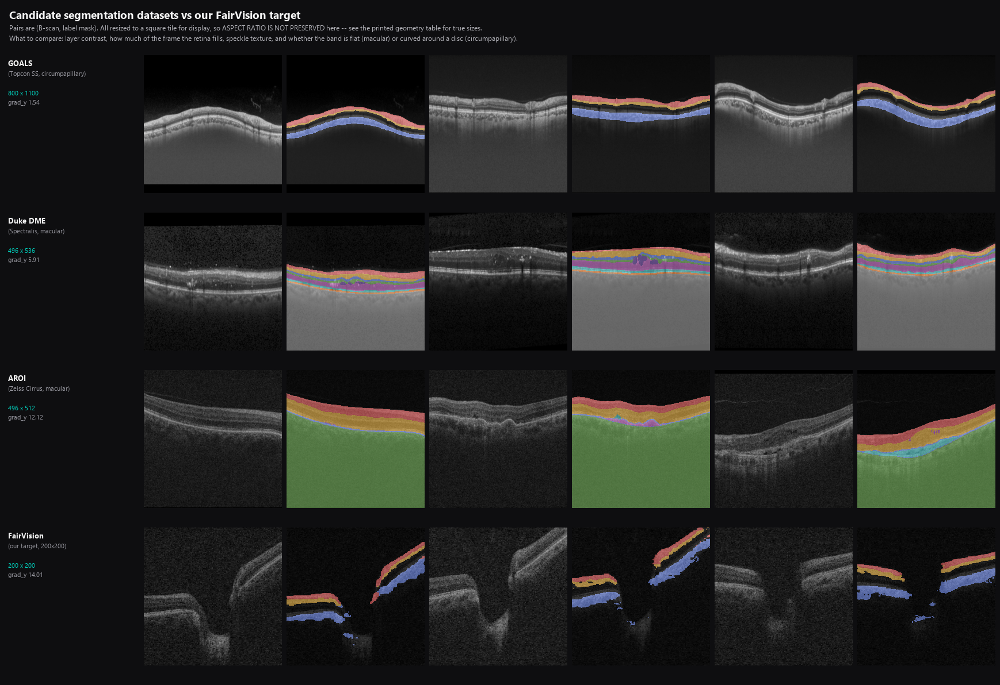

*Cross-dataset comparison of anatomy distribution and image characteristics.*

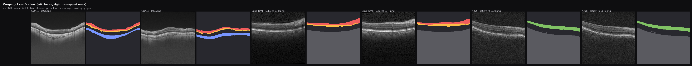

*Verification that the merged multi-dataset loader produces balanced sampling.*

---

## Reproduce

### Primary scripts

| Script | Purpose |
|---|---|
| `scripts\anatomy_target_sampler_v2.py` | `build_targets`, `grow_components`, `is_viable`, `region_capacity` |
| `scripts\adapter_sweep.py` | Cache, 12-config sweep, figure |
| `scripts\adapter_guardrails.py` | T1 generalisation, T2 budget lock, T3 localization |
| `scripts\adapter_stage.py` | JEPA EMA → L_rel → cfg-7 adapter, one-time |
| `scripts\precompute_soft_guides.py` | 600K-slice guide cache |
| `scripts\compare_arms.py` | Three-arm rendering |
| `scripts\fair_compare.py` | Honest production-collator measurement |
| `scripts\ctx_anatomy_probe.py` | Anatomy surviving in context |
| `scripts\ctx_informative_probe.py` | Image-statistics context quality |
| `scripts\demo_pipeline_trace.py` | Full pipeline trace figure |
| `scripts\demo_class_balance.py` | Random/oracle/anatomy class balance |
| `scripts\demo_split_fix.py` | Single-component before/after |
| `scripts\demo_backprop_effect.py` | Guardrail summary figure |
| `scripts\demo_before_after_grid.py` | 20-slice budget-locked grid |
| `scripts\demo_seg_before_after.py` | Raw frozen-head output changes |
| `scripts\jepa_to_mirage_probe.py` | Teacher sensitivity (circular) |

### Adapter sweep (staged)

```powershell
D:\jepa_phase0\.venv\Scripts\python.exe scripts\adapter_sweep.py --cache
D:\jepa_phase0\.venv\Scripts\python.exe scripts\adapter_sweep.py --sweep
D:\jepa_phase0\.venv\Scripts\python.exe scripts\adapter_sweep.py --figure
```

### Three-arm comparison

```powershell
# Each arm: one full FairVision epoch (600K slices, ~65-97 min)
D:\jepa_phase0\.venv\Scripts\python.exe train_patch.py --config configs/arm_random_default.yaml
D:\jepa_phase0\.venv\Scripts\python.exe train_patch.py --config configs/arm_random_matched.yaml
D:\jepa_phase0\.venv\Scripts\python.exe train_patch.py --config configs/arm_anatomy.yaml
```

### Data and environment

| Item | Value |
|---|---|
| Cached MIRAGE grids | `D:\jepa_phase0\mirage-goals\outputs\budget\grids_1k.npz` |
| Array | key `per`, shape `(1000,2,16,16)` |
| Channel order | `[P_inner, P_choroid]` |
| Python environment | `D:\jepa_phase0\.venv` |
| Required packages | scipy, matplotlib, torch with CUDA |
| Not required | `timm` |

Before importing `fm_seg_config`, MIRAGE requires:

```python
sys.path.insert(0, str(MIRAGE_WS / "MIRAGE"))
os.chdir(MIRAGE_WS)
```

All figures are committed under `results\masking\`.
