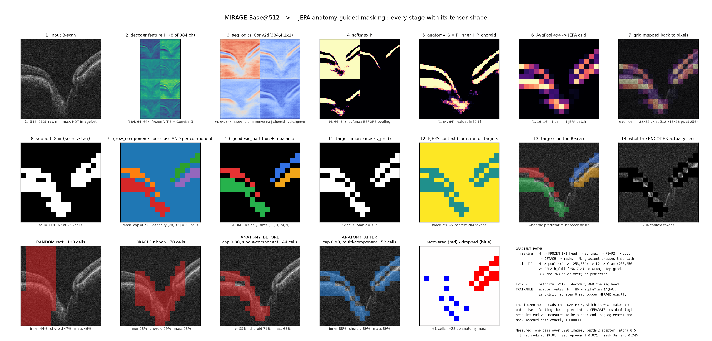
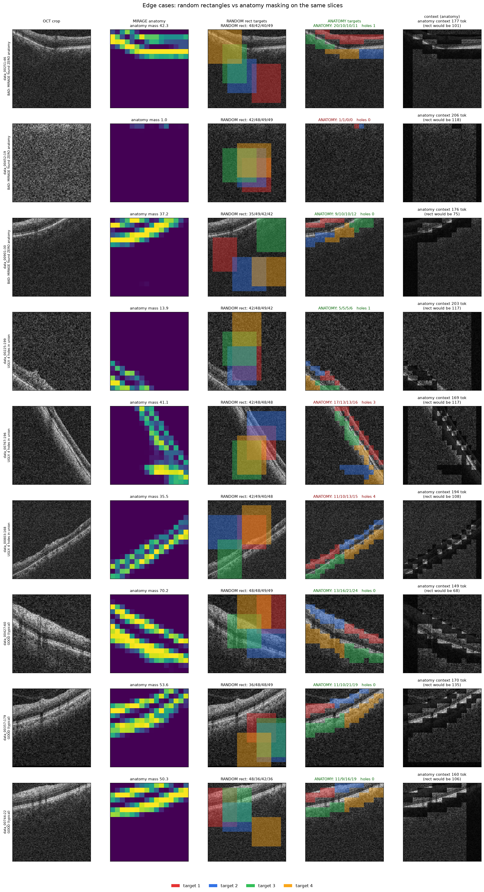

# MIRAGE-guided anatomy masking — ablation record

**Status:** authoritative as of 2026-08-08. The sampler and adapter have been
measured offline; the closed-loop JEPA smoke run has **not** started.

**Branch:** `vlm-guided-masking`

This document consolidates the masking investigations that were previously
split across the anatomy sampler, semantic multi-block, residual-adapter, and
completed MIRAGE-envelope notes. The broader curriculum research plan remains
in [`../curriculum_masking.md`](../curriculum_masking.md).

> **Claim boundary.** FairVision has no anatomy ground truth. An adapter output
> that **changed** is not known to have **improved**. Correctness requires a
> labelled set such as GOALS. With segmentation loss alone, the allowed claim is
> “MIRAGE continues improving via segmentation training while guiding JEPA,”
> never “JEPA improved MIRAGE.”

## Contents

- [Summary](#summary)
- [Method](#method)
  - [Pipeline and tensor shapes](#pipeline-and-tensor-shapes)
  - [Target sampler](#target-sampler)
  - [Adapter objective and gradient boundary](#adapter-objective-and-gradient-boundary)
- [Ablation: mask budget](#ablation-mask-budget)
- [Ablation: anatomy vs random vs oracle](#ablation-anatomy-vs-random-vs-oracle)
  - [Class balance and efficiency](#class-balance-and-efficiency)
  - [Dead targets](#dead-targets)
  - [Fallback behavior](#fallback-behavior)
- [Ablation: adapter architecture](#ablation-adapter-architecture)
- [Guardrail tests](#guardrail-tests)
- [Sampler bugs found and fixed](#sampler-bugs-found-and-fixed)
- [Historical precursors and retained lessons](#historical-precursors-and-retained-lessons)
- [Rejected designs](#rejected-designs)
- [Open blockers before training](#open-blockers-before-training)
- [Corrections to earlier claims](#corrections-to-earlier-claims)
- [Reproduce](#reproduce)

---

## Summary

### Headline: two effects, one cause

Anatomy is a minority of an OCT B-scan. Anatomy-shaped targets therefore spend
fewer grid cells and leave more of the original context block visible. Measured
over **1,000 slices** with the production `MaskCollator` and identical context
blocks:

| metric | RANDOM rect | ANATOMY (`mass_cap=0.90`) |
|---|---:|---:|
| target union cells | 122.6 | **53.4** |
| context after removal | 107.4 | **175.0** |
| context tokens with retina (`score>0.10`) | 25.6 | 17.4 |
| zero inner retina in context | 0.20% | **0.00%** |
| zero choroid in context | 0.30% | **0.00%** |
| zero anatomy tokens in context | 0.90% | 1.30% |

The two effects have one cause: concentrating the prediction task on anatomy
avoids spending most of the target union on background.

### Current decisions

| component | selected setting | reason |
|---|---|---|
| support threshold | `tau=0.10` | common definition of meaningful anatomy support |
| anatomy budget | `mass_cap=0.90` | best measured trade-off before the `0.99` context failure |
| target count | `n=4` | preserves the I-JEPA four-target task |
| component handling | grow all components; retain at most `n` and redistribute budget | fixes stranded and orphaned anatomy |
| empty-target gate | `is_viable(min_cells=4)` | zero empty targets reach the collator in the **1,000-slice** audit |
| fallback | random rectangles | baseline-consistent and more robust than the centred oracle on edge crops |
| adapter | cfg 7: depth 2, width 128, peak LR `1e-3`, `alpha=0.5`, dropout 0 | depth-2 knee in the **6,000-image** one-pass sweep |
| adapter mask budget | lock cell count to the frozen guide | separates relocation from task-size expansion |
| JEPA gradient into MIRAGE | detached hard mask | `grad_MIRAGE L_JEPA = 0` by construction |

The numerical tables below come from different controlled probes. Their cell
counts should not be spliced across tables: each section states its own sample,
collator, and comparison arms.

---

## Method

### Pipeline and tensor shapes



*Full pipeline on one real slice. The figure records every tensor shape,
`mass_cap=0.90`, multi-component growth, and the before/after effect of fixing
single-component growth.*

The crop must branch **before** normalization so both models see the same
anatomy:

```text
same sampled crop
├── JEPA view:   (B,3,256,256), ImageNet-normalized
└── MIRAGE view: (B,1,512,512), raw per-slice min-max, no ImageNet normalization

MIRAGE-Base@512, frozen
  H0:                         (B,384,64,64)
  H = H0 + α tanh(A(H0)):     (B,384,64,64)
  frozen segmentation head:  (B,4,64,64)
  softmax:
    P_inner, P_choroid:       (B,2,64,64)
  average pool 4×4:           (B,2,16,16)
  detach:
    grow + partition:         four target index tensors
  production MaskCollator:
    original context block minus target union
```

The frozen segmentation head reads the **adapted** feature tensor `H`, not
`H0`. This makes the adapter-to-guide path live while leaving the MIRAGE base
weights frozen.

### Target sampler

`scripts\anatomy_target_sampler_v2.py` builds four class-aware targets:

1. Build separate supports for inner retina and choroid with
   `support = score > 0.10`.
2. Grow **every** connected component inside each support. Split the class mass
   budget across components by their mass share.
3. If there are more than four components, retain the heaviest four and
   redistribute the full budget over those retained components.
4. Allocate the four targets using both grown mass and region capacity; a class
   with zero capacity cannot claim a target.
5. Partition each retained region by farthest-point seeding plus multi-source
   BFS. Rebalance only across adjacent borders while preserving connectivity.
6. Gate with `is_viable(min_cells=4)`; use random rectangles when the total
   capacity cannot support four targets.

Anatomy determines **which** cells enter a region. Geometry determines **how**
that region is divided. Overlap is off by default, small holes are limited to
at most two cells, and the original I-JEPA context policy remains unchanged.

`build_targets_fixed_cells` applies the same geometry with a cell budget
supplied by a frozen reference score. That is the budget-lock path used by the
adapter guardrail.

### Adapter objective and gradient boundary

The selected adapter uses

```text
H = H0 + alpha * tanh(A(H0))
```

with `alpha=0.5`. The frozen MIRAGE head consumes `H`. The unsupervised
relation objective is

```text
L_rel = MSE(Gram(pool(H)), stop_gradient(Gram(h_full)))
```

where `h_full` comes from the JEPA EMA target encoder at epoch 100. No anatomy
labels are used.

The mask passed to JEPA is hard and detached:

```text
MIRAGE/adapter ──> scores ──> hard target indices ── DETACH ──> JEPA
```

Thus JEPA loss cannot optimize target selection through the discrete mask.
Only `L_rel` trains the adapter in the measured configuration.

---

## Ablation: mask budget

### Mass-cap sweep

Measured on **500 slices** with multi-component growth and the production
collator:

| cap | target cells | anatomy mass | dead diagnostic | inner retina masked | context tokens | retina-in-context | zero-retina context |
|---|---:|---:|---:|---:|---:|---:|---:|
| RANDOM | 122.0 | 0.556 | 2.40% | 0.516 | 107.7 | 25.1 | 1.00% |
| 0.80 | 46.1 | 0.758 | 0.46% | 0.725 | 181.3 | 25.6 | 0.80% |
| 0.85 | 50.5 | 0.808 | 0.46% | 0.774 | 177.4 | 21.7 | 0.80% |
| **0.90** | **55.9** | **0.858** | **0.46%** | **0.825** | **172.7** | **17.0** | **0.80%** |
| 0.95 | 63.3 | 0.909 | 0.46% | 0.875 | 166.1 | 10.4 | 1.00% |
| 0.99 | 69.2 | 0.907 | 0.46% | 0.885 | 160.7 | 5.0 | **21.00% — breaks** |

The sweep’s `dead diagnostic` is retained under its emitted name; it is not the
separately defined per-target dead rate in [Dead targets](#dead-targets).

`mass_cap=0.90` is the default because, in this **500-slice** sweep, it masks
82.5% of inner-retina mass versus 51.6% for random, leaves 172.7 context tokens
versus 107.7, and keeps the zero-retina-context rate below random
(0.80% versus 1.00%). At `0.99`, the zero-retina rate rises to 21.00%.

### Known cost: confident anatomy can disappear

At `score>0.50`, **76.2% of the 500 cap-sweep slices** have no confident anatomy
left in context at `mass_cap=0.90`, versus **2.0%** for random. This does not
contradict the 0.80% zero-retina rate above: the latter uses the much weaker
`score>0.10` support threshold.

This is an open risk. If a two-to-three-epoch smoke run shows predictor
flattening, the first budget change to revisit is a per-slice confident-context
floor, not a return to single-component growth.

---

## Ablation: anatomy vs random vs oracle

### Class balance and efficiency


*Four-panel class-balance analysis on **1,000 slices** using the same MIRAGE
probability maps for all three methods.*

| method | target cells | inner retina masked | choroid masked | inner/choroid |
|---|---:|---:|---:|---:|
| RANDOM rect | 122.6 | 0.516 | 0.575 | **0.899 — most choroid-biased** |
| ORACLE ribbon | 70.0 | 0.625 | 0.602 | 1.037 |
| ANATOMY | 46.6 | **0.726** | **0.752** | 0.966 |

Efficiency in the same **1,000-slice** probe, expressed as percentage of class
mass hidden per cell spent:

| method | inner efficiency | choroid efficiency |
|---|---:|---:|
| RANDOM rect | 0.42 | 0.47 |
| ORACLE ribbon | 0.89 | 0.86 |
| ANATOMY | **1.56** | **1.61** |

The anatomy sampler is 3.7× as efficient as random for inner-retina mass in
this probe (`1.56/0.42`). The data do contain a choroid tendency, but **random
rectangles are the worst offender**, not the anatomy sampler.

### Dead targets

A target is dead when it contains no cell with anatomy score above `0.10`.
Measured over **1,000 slices × 4 targets = 4,000 targets**:

| outcome | RANDOM rect | ANATOMY including fallback |
|---|---:|---:|
| dead targets | **14.12% (565/4,000)** | **2.12% (85/4,000)** |
| slices where all four targets are dead | 2.40% (24/1,000) | 1.70% (17/1,000) |

Random spends roughly one target in seven on pure background. The anatomy arm,
including its random fallback cases, has 6.7× fewer dead targets
(`14.12/2.12`) in this **4,000-target** comparison.

### Fallback behavior



*Edge cases for both methods, including crops with little or off-centre
anatomy.*

Fallback must use random rectangles, not the oracle ribbon. On the real
degenerate crop `data_08569/slice_199` (**one edge-case crop**), the only retina
is a faint sliver at the left edge:

| metric | ORACLE ribbon | ANATOMY |
|---|---:|---:|
| cells masked | 70 | 18 |
| anatomy score captured | 46.2% | **63.4%** |
| mean brightness inside | 0.2343 | **0.2847** |

The anatomy target was 1.52× brighter than its surroundings on that crop. The
oracle searches only central columns 3–12 of the 16-column grid, while the
retina occupied columns 0–5. Random rectangles are also the honest fallback:
they are the baseline arm rather than a third mask distribution.

---

## Ablation: adapter architecture


*Twelve configurations, before/after masks, and the relation-loss versus
drift trade-off.*

Each configuration received **one pass over 6,000 FairVision images** at batch
16 (**375 optimizer steps**). Endpoint diagnostics were computed on **64
evaluation images**. Wiring was identical across rows: the frozen segmentation
head read the adapted feature tensor.

| cfg | depth | width | peak LR | alpha | params | `L_rel` down | feature drift | frozen-output agreement | mask Jaccard | seconds |
|---:|---:|---:|---:|---:|---:|---:|---:|---:|---:|---:|
| 0 | 0 | 64 | 1e-4 | 0.25 | 86,528 | 8.6% | 0.0934 | 0.9884 | 0.8672 | 50 |
| 1 | 0 | 64 | 1e-4 | 0.50 | 86,528 | 17.3% | 0.1872 | 0.9748 | 0.7449 | 49 |
| 2 | 0 | 64 | 1e-3 | 0.25 | 86,528 | 10.8% | 0.0953 | 0.9868 | 0.8447 | 51 |
| 3 | 0 | 64 | 1e-3 | 0.50 | 86,528 | 20.6% | 0.1918 | 0.9734 | 0.7296 | 52 |
| 4 | 2 | 128 | 1e-4 | 0.25 | 689,664 | 9.3% | 0.0541 | 0.9878 | 0.8462 | 57 |
| 5 | 2 | 128 | 1e-4 | 0.50 | 689,664 | 18.9% | 0.1164 | 0.9757 | 0.7238 | 57 |
| 6 | 2 | 128 | 1e-3 | 0.25 | 689,664 | 14.8% | 0.0919 | 0.9852 | 0.8560 | 56 |
| **7** | **2** | **128** | **1e-3** | **0.50** | **689,664** | **29.9%** | **0.1848** | **0.9713** | **0.7454** | **60** |
| 8 | 4 | 128 | 1e-4 | 0.25 | 1,280,512 | 9.9% | 0.0599 | 0.9875 | 0.8628 | 61 |
| 9 | 4 | 128 | 1e-4 | 0.50 | 1,280,512 | 20.1% | 0.1306 | 0.9761 | 0.7860 | 62 |
| 10 | 4 | 128 | 1e-3 | 0.25 | 1,280,512 | 15.0% | 0.0927 | 0.9851 | 0.8664 | 62 |
| 11 | 4 | 128 | 1e-3 | 0.50 | 1,280,512 | 30.3% | 0.1861 | 0.9716 | 0.7364 | 62 |

At matched LR and alpha, depth 0→2 raises relation-loss reduction from 20.6%
to 29.9% in the **6,000-image** sweep, while depth 2→4 adds only 0.4 points
(29.9%→30.3%). Depth 2 is therefore the knee. Across all 12 rows, alpha is the
largest lever, LR is second, and depth is third. Peak LR `1e-3` beats `1e-4` in
every matched pair with AdamW, OneCycle scheduling, and gradient clipping at
1.0.

**Selected:** cfg 7 — depth 2, width 128, peak LR `1e-3`, `alpha=0.5`,
dropout 0. It gives 29.9% relation-loss reduction with nearly the same drift as
the 30.3% maximum while using 46% fewer parameters than depth 4
(689,664 versus 1,280,512).

### Memorisation warning

An earlier probe ran **400 optimization steps on the same 24 slices** and
reported 76.8% relation-loss reduction. That was memorisation. The honest
single-pass sweep gives 29.9% for the selected cfg 7 and 30.3% for the
depth-4 maximum after **6,000 distinct training images**. The 24-slice result
must not be used as an expected training effect.

---

## Guardrail tests


*Cfg 7 trained on 4,800 images, with a disjoint 1,200-image holdout. Reported
split metrics use 192 sampled train images and 192 sampled held-out images.*

### T1 — held-out generalisation

| split | evaluation images | `L_rel` before | `L_rel` after | reduction | feature drift | frozen-output agreement |
|---|---:|---:|---:|---:|---:|---:|
| train sample | 192 | 0.33636 | 0.23684 | 29.59% | 0.181 | 0.971 |
| held-out sample | 192 | 0.33719 | 0.23673 | 29.79% | 0.182 | 0.971 |

No train/held-out gap is visible in this **192-versus-192** evaluation. The
adapter learned a repeatable transformation rather than a lookup table for the
4,800 training images.

### T2 — budget lock

On the **192 held-out evaluation images**, the unconstrained adapter widens the
guide:

| guide | mean cells | Jaccard versus frozen mask |
|---|---:|---:|
| frozen | 50.6 | 1.000 |
| adapted, free budget | 59.8 | 0.805 |
| adapted, frozen cell budget | **47.2** | **0.737** |

Locking the budget removes expansion as an explanation while still changing
placement: mask Jaccard moves only from 0.805 to 0.737. Approximately 26% of
cells relocate in either mode over the **192 held-out images**; the guide change
is not driven by simply making the prediction task larger.

### T3 — where the adapter acts

Measured over the same **192 held-out images**:

| statistic | value |
|---|---:|
| `corr(abs(delta score), frozen top1-top2 margin)` | **-0.7159** |
| cells with margin `<0.5` | 0.2% |
| mean absolute change at margin `<0.5` | 0.14307 |
| cells with margin `>=0.9` | 90.2% |
| mean absolute change at margin `>=0.9` | 0.01399 |
| uncertain/sure change ratio | **10.2×** |

The adapter changes uncertain boundaries much more than confident interiors.
The uncertain bucket is only 0.2% of cells, so the full-range correlation
`-0.7159` is the more stable statistic.


Across the **20 randomly selected held-out slices** in this grid, budget-locked
mask Jaccard is 0.773 on average (range 0.52–0.96), and the mean cell-count
change is -1.6.


*Raw frozen-head outputs before and after adaptation. This figure demonstrates
change, not segmentation improvement; no FairVision anatomy labels are
available.*

---

## Sampler bugs found and fixed

### Bug A — single-component growth

`grow_region()` seeded once at the global maximum and could fill only that
seed’s connected component. Over **1,982 class-regions**:

| diagnostic | measured value |
|---|---:|
| mass captured when the cap requested 80% | 74.9% |
| mass excluded below `tau=0.10` | 1.6% |
| mass stranded in other components | 5.8% |
| regions where the cap actually bound | 18.9% |
| regions stopped by component exhaustion | 81.1% |
| class-regions with split support | 19.9% |
| mean class mass stranded when support was split | 29.2% |

The common cause is anatomical: at the optic nerve head, the retinal band can
be interrupted and inner retina arrives as multiple segments.

`grow_components()` now grows every component and assigns budget by mass share.
At cap 0.80 in the same **1,982-region** audit, captured mass moved
0.740→0.774 while mean cells fell 46.5→44.1.


### Bug B — orphaned components

`build_targets()` creates exactly four targets. Before the fix,
`grow_components()` could return more than four regions; surplus regions
received no target and silently disappeared.

Component count over **1,000 slices** at `mass_cap=0.90`:

| components | slices |
|---:|---:|
| 2 | 71.8% |
| 3 | 13.2% |
| 4 | 6.0% |
| 5 | 5.3% |
| 6 | 2.6% |
| 7–8 | 0.3% |

In that **1,000-slice** audit, 8.4% of slices exceeded four components,
orphaning 1.50 components on average and discarding 28.6% of grown capacity
(93.1% worst case).

The fix caps retained components at `n=4` and recomputes their mass shares:

| diagnostic, 1,000 slices | before | after |
|---|---:|---:|
| mean capacity discarded | 28.6% | **0.27%** |
| maximum capacity discarded | 93.1% | **15.4%** |
| slices losing more than 5% capacity | 84 | **17** |
| union cells | 53.4 | **54.9** |
| anatomy mass | 0.858 | **0.890** |

### Empty-target allocation

The original allocator used `present = mass > 1e-6`. Softmax mass is positive
almost everywhere, so a class with zero support cells could still claim a
target. In the **1,000-slice** audit:

| cause | contribution | status |
|---|---:|---|
| unsupported class claimed a target | 1.0 percentage point | allocation bug, fixed |
| MIRAGE found no usable anatomy | 0.4 percentage point | real data condition |

Example from that audit: inner retina had mass 4.88 over 10 support cells,
choroid had mass 0.04 over zero support cells, and the old allocator returned
`[3,1]`. Capacity-aware allocation returns `[4,0]`. Empty incidence fell from
1.40% to 0.90%.

The residual cases have fewer than four grown cells in total. Gating on
capacity gives:

| `min_cells` | fallback rate, 1,000 slices | empty targets reaching collator |
|---:|---:|---:|
| 2 | 1.20% | 0 |
| 3 | 1.90% | 0 |
| **4** | **2.30%** | **0** |
| 5 | 2.60% | 0 |

`min_cells=4` is selected. It removes empty targets, but it does not yet
guarantee a four-cell minimum for **each** partition; a one-cell thin tail can
still create a one-cell target. That remaining hazard is blocker B-4.

---

## Historical precursors and retained lessons

These results concern earlier rectangular-placement or adapter designs. They
are retained because they explain why the current sampler and controls exist,
but they are not interchangeable with the current anatomy-shaped target tables.

### Completed MIRAGE-envelope arm


The completed arm biased conventional rectangles into a repaired MIRAGE
envelope. Its policy sweep covered **1,000 volumes / 19,987 slices**:

| legacy placement method | target purity | unique target cells | context tokens |
|---|---:|---:|---:|
| RANDOM | 0.4530 | 112.4 | 107.6 |
| ORACLE | 0.5602 | 101.9 | 116.6 |
| MIRAGE envelope, threshold 0.25 | **0.6320** | 101.7 | 117.2 |

Yet on the **3,000-volume FairVision Test split**, frozen MeanPool at epoch 100
ranked the completed pretraining arms differently:

| arm | Test AUC |
|---|---:|
| random | 0.8746 |
| **oracle** | **0.8855** |
| MIRAGE envelope | 0.8807 |

The legacy result established that mask purity is not a validated proxy for
downstream AUC. Its class-specific audit over **2,374 slices** found that 96.8%
of MIRAGE’s extra on-tissue placement over the oracle was choroid while
inner-retina coverage was nearly unchanged (ratio 1.007). That finding applies
to the legacy rectangular envelope arm. The current **1,000-slice** class
balance shows that random rectangles, not anatomy-shaped targets, are the most
choroid-biased current method.

The completed arm also exposed two engineering confounds:

| issue | measured effect and sample |
|---|---|
| threshold wired differently in dataset and collator | over **2,560 images**, fixing 0.50→0.25 changed admissible cells 67.03→74.85, target union 115.47→120.56, context 116.52→111.82, and infeasible blocks per batch 2.20→0.80 |
| sweep/training spread mismatch | over **2,374 slices**, the measured spread-off geometry was oracle 100.6 versus MIRAGE 100.9 cells, while the shipped spread-on config was oracle 100.9 versus MIRAGE 108.8 cells |


### Direct block-anatomy intersection (`A'`) — rejected precursor

On **300 masks from 12 slices × 25 crops**, intersecting each rectangle with
the anatomy support halved the delivered geometry:

| metric | rectangles | `A' = rectangle ∩ anatomy` |
|---|---:|---:|
| target union cells | 123.8 | **58.9** |
| frame fraction | 0.484 | **0.230** |
| connected components | 1.08 | 1.53 |
| largest-component share | 0.968 | 0.887 |

Across **1,200 guided blocks**, one block was empty (0.08%). Projected to
256 block draws in a batch, that implies about a 19% chance of at least one
empty. For non-empty batches, the measured size distribution implied an
expected batch minimum of about 11.3 cells and only about 45 cells delivered
across four targets, versus roughly 102–112 in the comparison arms.

`A'` was rejected because it changes target area, leaks the anatomy-shaped
target index set through predictor positional embeddings, systematically loses
deep rows under row-major truncation, and approaches whole-retina masking.

### Rectangular anisotropy — useful but superseded

Before switching to anatomy-shaped targets, block shape was tested while
holding rectangle area fixed. On **300 masks from 12 slices × 25 crops**:

| aspect ratio | on-region purity | target cells | mean block height | accept rate | feasible rate | retina visible |
|---|---:|---:|---:|---:|---:|---:|
| 0.75–1.50 | 0.4752 | 123.8 | 7.04 | 0.6167 | 0.9967 | 0.2526 |
| 0.50–1.00 | 0.5036 | 111.6 | 5.73 | 0.9067 | 1.0000 | 0.2888 |
| **0.30–0.60** | **0.5395** | **103.1** | **4.47** | **0.9833** | 1.0000 | **0.2964** |
| 0.20–0.45 | 0.5600 | 101.4 | 3.74 | 0.8967 | 1.0000 | 0.2831 |

The retinal band was 4.94 cells tall on average in those **300 crops**, while
the default rectangles were 7.04 cells tall. Wide rectangles were therefore a
better rectangular prior, but the current sampler removes the rectangle-shape
constraint entirely.

### JEPA-error scorer — geometric confound

On **20 slices** with the true four-target distribution:

| correlation or partial correlation | value |
|---|---:|
| error vs anatomy | -0.2675 |
| error vs distance to context centroid | **+0.5687** |
| error vs mean patch intensity | -0.3647 |
| error vs patch variance | -0.3243 |
| partial error vs anatomy, controlling intensity | -0.0367 |
| partial error vs anatomy, controlling distance | -0.0855 |
| partial error vs anatomy, controlling distance + variance + intensity | +0.0425 |

An error-driven scorer would primarily learn distance from context, not
anatomy. That route was dropped before the current relation objective.

### JEPA-teacher sensitivity — circular, not causal


The sensitivity probe reused the same **24 slices for 400 steps**. Epoch-30 and
epoch-100 JEPA teachers had relation-matrix cosine 0.8799; after adaptation,
their masks had Jaccard 0.5517. Relation-loss reductions were 76.4% and 76.8%,
respectively, but both are memorisation results.

More importantly, both `jepa_to_mirage` checkpoints came from
`patch_mirage_envelope`, whose own training masks were MIRAGE-guided. The probe
is circular and may be reported only as teacher-sensitivity evidence, never as
evidence that JEPA improves MIRAGE.

---

## Rejected designs

| design | measurement | decision |
|---|---|---|
| **D1 pixel-level gate `s*x`** | on the measured 1,360 target-excluded patches, `dL/ds=0` for all 1,360; after 200 Adam steps `max(abs(s-0.5))=0`; blank input loss 0.2143 versus real input 0.2893 | rejected: no gradient where selection is needed, and blanking is cheaper |
| **D2 token gate + straight-through top-k** | over **20 slices**, four temperatures, and 600 steps, `corr(dL/dq,error)=+0.24` to `+0.93`; low temperature left 26% live gates, high temperature produced a 29% straight-through gap | rejected: always favors already-easy targets |
| **D3 detached hard mask** | `grad_MIRAGE L_JEPA=0` by construction | accepted |
| **separate residual logit head** | over the wrong-wiring **24-slice, 400-step** probe, the new head received `0.000e+00` gradient without labelled `L_seg`; frozen-output agreement and mask Jaccard were both exactly 1.000000 | dead end: the frozen head must read adapted `H` |
| **extent-based budget** | three formulations changed coverage by only 0.001–0.011; unconstrained extent-greedy growth consumed 255/256 cells; the source note did not retain the probe sample count | rejected: mass cap binds first |
| **rank-cut geodesic ordering** | 29.7% of the **300 slices** produced disconnected chunks | rejected |
| **largest-to-smallest rebalancing** | size spread was 3.54 in the **300-slice** sampler design probe, and chunks formed a chain | rejected |
| **constrained projector for `L_sem`** | the **40-slice, 400-step** projector probe produced 233% feature churn with 0.0% gain | rejected |
| **direct `A'` intersection** | 58.9 versus 123.8 target cells over 300 masks; projected ~19% empty-batch risk from 1,200 blocks | rejected |
| **JEPA-error scorer** | distance-to-context correlation +0.5687 versus anatomy -0.2675 over 20 slices | rejected as geometrically confounded |

---

## Open blockers before training

| ID | blocker | measured evidence | required action |
|---|---|---|---|
| **B-1** | `global_min_pred` truncation is fatal | in the batch-64 variable-target probe, `global_min_pred==1` in 69.2% of batches and only 15.3% of intended target area survives; an empty tensor crashes `torch.stack` | use fixed target cardinality per microbatch |
| **B-2** | in-loop cost | batch-64 benchmark: sampler 5.30 ms/image = 339 ms/batch; MIRAGE-Base@512 adds about 0.43 s/batch at 148.7 img/s; batch 64 × accumulation 8 adds about 6.1 s/optimizer step | precompute masks from frozen `H0` where possible |
| **B-3** | paired views are absent | dataset currently returns one `(3,256,256)` ImageNet-normalized tensor, while MIRAGE needs the same crop at `(1,512,512)` with raw min-max values | branch the paired dataset before normalization |
| **B-4** | a one-cell target is still reachable | `is_viable(min_cells=4)` constrains total capacity, not every geodesic partition | guarantee fixed per-target cardinality before collation |
| **B-5** | task-size confounds | over 1,000 paired slices, anatomy union is 53.4 cells versus random 122.6, and context is 175.0 versus 107.4 | add random connected blobs matched for cardinality and anatomy masks matched for context size |
| **B-6** | closed-loop feedback is untested | zero real JEPA epochs have run with the adapter loop | run 2–3 epochs while logging the diagnostics below |

Padding plus a loss mask is not an acceptable B-1 fix: padded tokens still
participate in predictor self-attention, and the current attention
implementation has no padding mask.

The B-6 smoke run must track:

- `L_JEPA`
- `L_rel`
- target cell count
- mask Jaccard versus the initial guide
- adapter feature drift
- JEPA EMA relation-matrix drift

The kill condition is runaway co-adaptation: rapidly changing masks or adapter
drift accompanied by flattening JEPA prediction, rather than a stable
budget-locked relocation.

---

## Corrections to earlier claims

Recorded so superseded statements are not repeated.

| earlier statement | correction |
|---|---|
| default `mass_cap=0.80` | **superseded.** After multi-component growth, the **500-slice** production-collator sweep selects `0.90`. |
| old cap-sweep and coverage tables | **superseded.** They predated multi-component growth; use the 500-slice table in this document. |
| “the residual head gets zero gradient, so the guide is static and can be precomputed” | **wrong wiring.** A separate residual logit head is dead, but with the frozen head reading adapted `H`, the **192-image held-out** probe gives frozen-output agreement 0.9705 and budget-locked mask Jaccard 0.7365. |
| “76.8% `L_rel` reduction” as an expected effect | **memorisation.** It came from 400 steps on the same 24 slices. The **6,000-image** one-pass result is 29.9% for cfg 7 and 30.3% at the sweep maximum. |
| “I-JEPA scattered ablation 54.2→19.2” | **wrong table reading.** The cited I-JEPA comparison is random patches 17.6 versus multi-block 54.2. |
| “`L_sem` is harmful” | **wrong.** The **40-slice, 300-step** probe measured gradient cosine -0.076 and frozen-output agreement 0.9999 at `lambda=1.0`; it showed ineffectiveness, not harm. |
| “ViT-L interpolates positional embeddings at its own resolution” | **wrong.** Neither inspected checkpoint did so. |
| “57.6–89.3% of gradient reaches MIRAGE” | **wrong label.** Those numbers were `L_rel` reduction, not gradient share; only the adapter was trainable in that probe. |
| “anatomy context is diluted: 48.7% informative versus 58.3%” | **indexing bug.** After fixing flattened indices, the **1,000-slice** image-statistics probe measured 58.7% versus 57.9%. |
| “84.2 context tokens is what the collator gives” | **incomplete.** It was a post-truncation batch-8 value; the per-image rectangle context was about 100–105 in the **40-batch-per-size** audit. |
| checking `p.grad is None` proves MIRAGE is detached | **wrong test.** Frozen parameters have no `.grad` even when gradients flow through activations; assert `H.grad_fn is None` and `H.requires_grad==False`. |
| dropout makes masks stochastic | **predicted, then measured false.** The recorded dropout probe produced mask Jaccard 1.0000 in train and eval; its exact image count was not retained. |
| the void class invalidates the anatomy score | **overstated.** Across **25,600 measured cells**, mean void probability was `1.1e-5`, correlation with the corrected score was 0.99999997, and one cell crossed `tau`. |
| anatomy masking is the most choroid-biased method | **wrong for the current sampler.** In the **1,000-slice** class-balance probe, inner/choroid is 0.899 for random, 1.037 for oracle, and 0.966 for anatomy; random is the worst. |
| changed MIRAGE outputs imply better segmentation | **not supported.** FairVision has no anatomy labels. Report change, drift, agreement, relocation, or labelled-set accuracy only. |
| `jepa_to_mirage` shows JEPA improved MIRAGE | **circular.** The 24-slice teachers came from a run already trained with MIRAGE-guided masks; report sensitivity only. |

Probe-code defects corrected during this work included flattened-index
corruption, mismatched context definitions between arms, unseeded crop RNG,
`ImportError` handling that swallowed sampler failures, and seeding PyTorch
instead of Python’s `random` for a collator that uses the latter.

---

## Reproduce

### Primary scripts

| script | purpose |
|---|---|
| `scripts\anatomy_target_sampler_v2.py` | `build_targets`, `build_targets_fixed_cells`, `grow_components`, `is_viable`, and `region_capacity` |
| `scripts\ctx_anatomy_probe.py` | anatomy content surviving in production-collator context |
| `scripts\ctx_informative_probe.py` | image-statistics context quality |
| `scripts\adapter_sweep.py` | cache, 12-configuration sweep, and sweep figure |
| `scripts\adapter_guardrails.py` | T1 held-out generalisation, T2 budget lock, and T3 confidence localization |
| `scripts\demo_pipeline_trace.py` | full pipeline trace |
| `scripts\demo_class_balance.py` | random/oracle/anatomy class balance |
| `scripts\demo_split_fix.py` | single-component before/after |
| `scripts\demo_backprop_effect.py` | guardrail summary figure |
| `scripts\demo_before_after_grid.py` | 20-slice budget-locked grid |
| `scripts\demo_seg_before_after.py` | raw frozen-head output changes |
| `scripts\jepa_to_mirage_probe.py` | epoch-30 versus epoch-100 sensitivity; circular, not causal |

The adapter sweep is staged:

```powershell
D:\jepa_phase0\.venv\Scripts\python.exe scripts\adapter_sweep.py --cache
D:\jepa_phase0\.venv\Scripts\python.exe scripts\adapter_sweep.py --sweep
D:\jepa_phase0\.venv\Scripts\python.exe scripts\adapter_sweep.py --figure
```

### Data and environment

| item | value |
|---|---|
| cached MIRAGE grids | `D:\jepa_phase0\mirage-goals\outputs\budget\grids_1k.npz` |
| array | key `per`, shape `(1000,2,16,16)` |
| channel order | `[P_inner, P_choroid]` |
| Python environment | `D:\jepa_phase0\.venv` |
| required packages | scipy, matplotlib, torch with CUDA |
| not required | `timm` |

Before importing `fm_seg_config`, MIRAGE requires:

```python
sys.path.insert(0, str(MIRAGE_WS / "MIRAGE"))
os.chdir(MIRAGE_WS)
```

All figures referenced above are committed or present under
`results\masking\`. Do not regenerate figures as part of documentation-only
changes.
