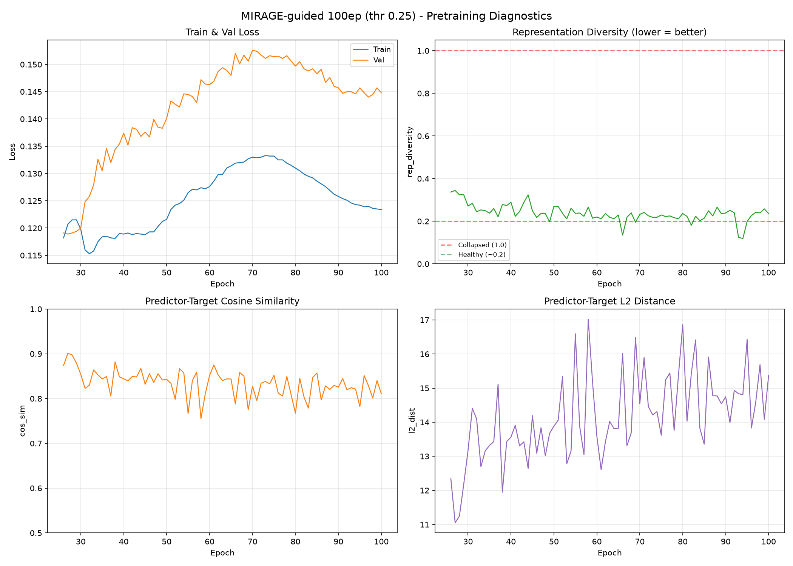
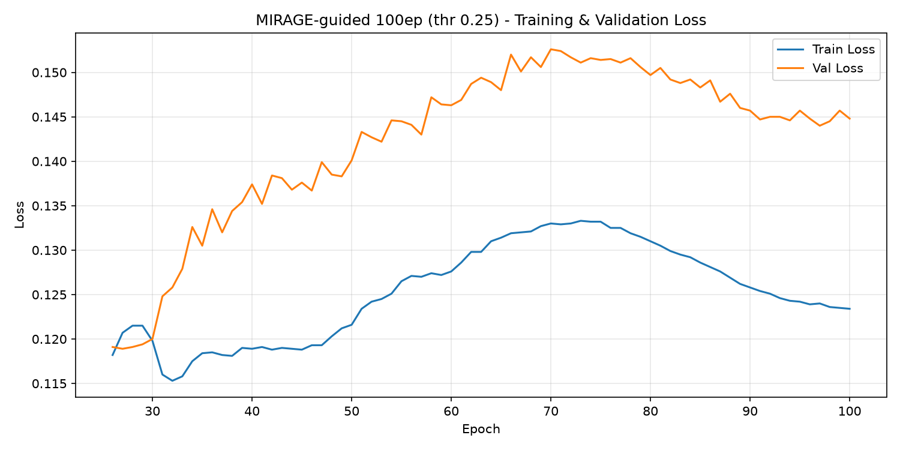
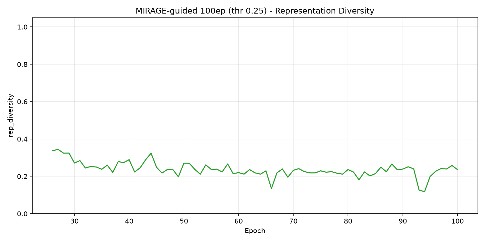
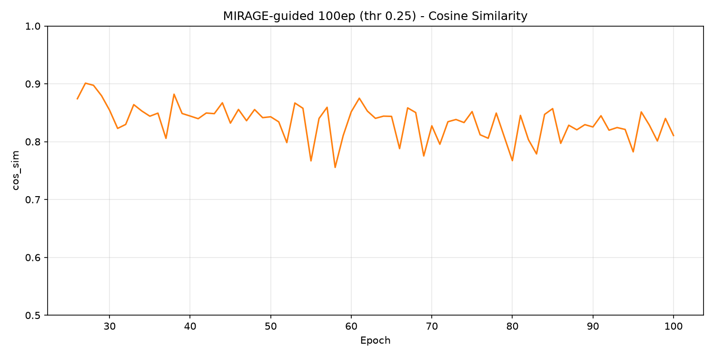

# Pretraining: MIRAGE-guided masking (warm-start ep25, 100ep)

MIRAGE-guided masking run. Warm-started from **ep25 of the random-init run**
(`d1_sweep.md` baseline, `patch_vit_base_ps16_ep100_bs64_lr0.00025_20260411_063607`),
then trained ep26→100 with a curriculum that ramps random masking into
**MIRAGE-guided** placement — target blocks biased onto the repaired retinal
envelope produced by MIRAGE-Large (GOALS-trained). **Completed** 2026-08-04,
locally on one RTX 3090.

This is Rung 1b of the masking ladder. Rung 1 (`oracle_100ep.md`) asked whether
a *hand-crafted* anatomical band beats random. This asks whether a **real
segmentation model** can supply the same prior, so that a positive result is
not an artefact of the band having been hand-fitted to this dataset.

Masking policy selection, the guide construction, and where the oracle band
fails are documented in
[`../masking/ablations.md`](../masking/ablations.md#completed-mirage-envelope-arm).

## Lineage (why the comparison is clean)

```
random-init run:  ep0 ───────────────────────────► ep100   (all random masking)
                       │
                       ├─ ep25 fork (warm-start)
                       ├──► oracle run:  ep25 ──[curriculum ep26–30]──► ep100  (anatomical_prior)
                       └──► MIRAGE run:  ep25 ──[curriculum ep26–30]──► ep100  (mirage_envelope)
```

All three arms share the same ep25 weights (SHA-256
`e5ad5b0c2aadfa15449409786afbfa39d8b5405b699be8f02f2e540195e97e7b`). The only
variable versus the oracle arm is **where the four target blocks land**.

## Config

| Parameter | Value | vs oracle |
|-----------|-------|-----------|
| Architecture | ViT-B/16 | same |
| Initialization | **Warm-start from random ep25** | same |
| Masking | **Curriculum → mirage_envelope** | oracle: anatomical_prior |
| Curriculum | T_warm=25, T_total=30, r_max=1.0, linear ramp | same |
| Guide | MIRAGE repaired envelope, occupancy ≥ 0.25, dilation 0 | oracle: lateral_frac 0.6, region_frac 0.28 |
| Block fill / retina visible | ≥ 0.40 / ≥ 0.25 (best-effort) | n/a |
| I-JEPA masking | enc 0.85–1.0, pred 0.15–0.2, nenc=1, npred=4 | same |
| Learning Rate | 0.00025 (cosine → 1e-6), start 1e-4, warmup 5 | same |
| EMA | [0.996, 1.0] cosine | same |
| Weight Decay | 0.04 → 0.4 (cosine) | same |
| Batch | **64 × 1 GPU × 8 accum = 512 effective** | oracle: 64 × 4 × 2 = 512 |
| Num slices | 100 | same |
| Patience | 9999 (disabled) | same |
| Total Epochs | 100 | same |
| Output | `D:\jepa_phase0\runs\patch_mirage_envelope` | oracle: AML blob |

Iterations per epoch are **1171 in both arms** (oracle 600000/4/64 = 2343, //2;
ours 600000/64 = 9375, //8), so the LR/WD/EMA schedules advance identically
despite the different GPU count.

## Diagnostic Plots



| Plot | Description |
|------|-------------|
|  | Train & val loss. Same shape as oracle and random — rises into a mid-run peak (~ep70–75) then eases — but sits **below** the oracle on train at every matched epoch. |
|  | Representation diversity. 0.12–0.34 throughout (healthy; **no collapse**). ep100 = 0.236. |
|  | Predictor–target cosine. 0.755–0.901; the mid-run dip is **milder than the oracle's** (0.755 vs 0.69). |

## Training Summary

| Epoch | r_t | train_loss | val_loss | cos_sim | rep_div | l2_dist |
|-------|-----|-----------|----------|---------|---------|---------|
| 26 | 0.00 | 0.1182 | 0.1191 | 0.874 | 0.337 | 12.34 |
| 30 | **1.00** | 0.1198 | 0.1200 | 0.854 | 0.272 | 12.69 |
| 35 | 1.00 | 0.1184 | 0.1305 | 0.844 | 0.238 | 13.53 |
| 50 | 1.00 | 0.1216 | 0.1401 | 0.843 | 0.270 | 14.07 |
| 60 | 1.00 | 0.1276 | 0.1463 | 0.852 | 0.220 | 13.67 |
| 75 | 1.00 | 0.1332 | 0.1514 | 0.852 | 0.229 | 14.30 |
| 88 | 1.00 | 0.1269 | 0.1476 | 0.821 | 0.266 | 15.45 |
| 95 | 1.00 | 0.1242 | 0.1457 | 0.782 | 0.199 | 15.87 |
| **100** | 1.00 | **0.1234** | **0.1448** | 0.811 | 0.236 | 15.37 |

Full per-epoch data: [`logs/pretraining/mirage_epoch_summary.csv`](../../../logs/pretraining/mirage_epoch_summary.csv).

## MIRAGE vs Oracle at matched epochs

| Epoch | MIRAGE train / val | Oracle train / val | Δ train | Δ val |
|-------|--------------------|--------------------|---------|-------|
| 26 | 0.1182 / 0.1191 | 0.1186 / 0.1202 | −0.0004 | −0.0011 |
| 30 | 0.1198 / 0.1200 | 0.1197 / 0.1242 | +0.0001 | −0.0042 |
| 35 | 0.1184 / 0.1305 | 0.1232 / 0.1310 | −0.0048 | −0.0005 |
| 50 | 0.1216 / 0.1401 | 0.1316 / 0.1400 | **−0.0100** | +0.0001 |
| 60 | 0.1276 / 0.1463 | 0.1388 / 0.1489 | **−0.0112** | −0.0026 |
| 75 | 0.1332 / 0.1514 | 0.1404 / 0.1507 | −0.0072 | +0.0007 |
| 88 | 0.1269 / 0.1476 | 0.1335 / 0.1454 | −0.0066 | +0.0022 |
| 100 | 0.1234 / 0.1448 | 0.1303 / 0.1432 | −0.0069 | +0.0016 |

**Consistently lower train loss, essentially identical val loss** (within ±0.003
everywhere). Val is measured under *uniform* masking in both arms, so it is a
like-for-like probe of representation quality; train is measured under each
arm's own guided masking, so a lower value reflects the guided task being
easier, not the model being better. Per `lessons_learned.md` #1, neither number
is the quality signal — downstream AUC is.

## Problem check

1. **No collapse.** rep_diversity stays 0.12–0.34 across all 75 epochs (1.0 =
   collapsed); ep100 = 0.236, comparable to oracle's 0.210 and random's 0.229.
   The dips near 0.12 (ep93/94) are *more* diversity, not less.
2. **Curriculum executed as designed.** r_t = 0.0(ep25) → 0.2 → 0.4 → 0.6 → 0.8
   → **1.0(ep30)**, held at 1.0 through ep100.
3. **Masking behaved as calibrated.** At full guidance the collator reported
   target-on-region 0.445–0.463, retina_visible 0.23–0.25, `unbiased=0`, and
   0–2 infeasible blocks per batch of 64 — matching the 6.2% infeasible rate
   measured in the 1,000-volume policy sweep.
4. **Milder mid-run stress than the oracle.** cos_sim bottomed at 0.755 (ep58)
   versus the oracle's 0.69 (~ep55–65), and recovered similarly.
5. **Wider train/val gap than the oracle** at ep100: 0.021 vs 0.013. Since val
   is identical between arms while train is lower, this reflects the guided
   task being easier rather than degraded representations. Flagged for the
   downstream sweep.

## Interruptions (deviations from a single clean run)

The oracle arm ran as one uninterrupted AML job. This run did not:

- **Disk-bound first launch, aborted.** The initial attempt ran at 7.6 img/s
  with the GPU idle at 30 W because `OCTSliceDataset` decoded an entire 8 MB
  volume per 40 KB slice. Fixed with a slice cache
  (`scripts/build_slice_cache.py`); throughput went to 173 img/s. Log kept as
  `train_diskbound_aborted.log`.
- **Crash at epoch 32.** The validation loader spawned 6 workers on top of the
  training loader's 6 and exhausted the Windows commit limit (error 1455).
  Fixed with `val_num_workers: 2`. Because periodic saves were every 25 epochs,
  only ep27 survived, so **epochs 28–32 were discarded and re-run** from the
  ep27 checkpoint. `save_every` is now 5. Log kept as
  `train_run1_ep26-32_oom.log`.

Neither affects the initialization or the schedules in kind: on resume the
schedules fast-forward by `start_epoch × 1171` while the loop executes 1172
steps per epoch, leaving this run 27 optimizer steps behind an uninterrupted
one (~0.03% of ~85,000). The oracle arm had the identical off-by-25 at its own
ep25 resume. The re-run epochs 28–32 reproduced the originals to within 0.0017
train / 0.0018 val, which is independent evidence the pipeline is
deterministic.

## Available Checkpoints (local)

| Checkpoint | Epoch | Path |
|-----------|-------|------|
| `jepa_patch_mirage-ep30…ep100.pth.tar` | 30–100 every 5 | `D:\jepa_phase0\runs\patch_mirage_envelope\` |
| `jepa_patch_mirage-best.pth.tar` | ~28 (lowest val; r_t still ramping — **do not use for downstream**) | same |

Same `best`-checkpoint caveat as the oracle and random runs: val loss is lowest
while the ramp is still engaging, so `best` latches early. For downstream use
**fixed** ep50/75/100, never `best`.

## Downstream

Frozen MeanPool probe results and the oracle/random comparison:
[`../frozen/mirage_meanpool_sweep.md`](../frozen/mirage_meanpool_sweep.md).

**Test AUC 0.8761 / 0.8803 / 0.8807 at ep50/75/100.** MIRAGE beats random at
every epoch (+0.0062 at ep100, p=0.022) but loses to the oracle at ep100
(−0.0047, 95% CI [−0.0091, −0.0002]). That is the **paradox this rung
produced**: MIRAGE masks the retina more purely than the hand-crafted band
(target purity 0.632 vs 0.560) and still yields the weaker encoder — better
segmentation did not buy better representations.

A class-level re-scoring of the same placements
(`scripts/mirage_vs_oracle_region_split.py`, 2,374 slices) shows **96.8% of
MIRAGE's extra on-tissue masking is choroid**, with inner-retina coverage
unchanged (ratio 1.007), and that MIRAGE has **2.1× less placement freedom**
(5.34 vs 6.41 bits). The lower train loss in the table above is consistent with
that easier pretext task. Note also that `mirage_spread: true` in this run's
config was **not** the setting the policy sweep used to match masked area, so
this arm masked ~8% more of the image than the oracle — purity and geometry are
confounded here.
