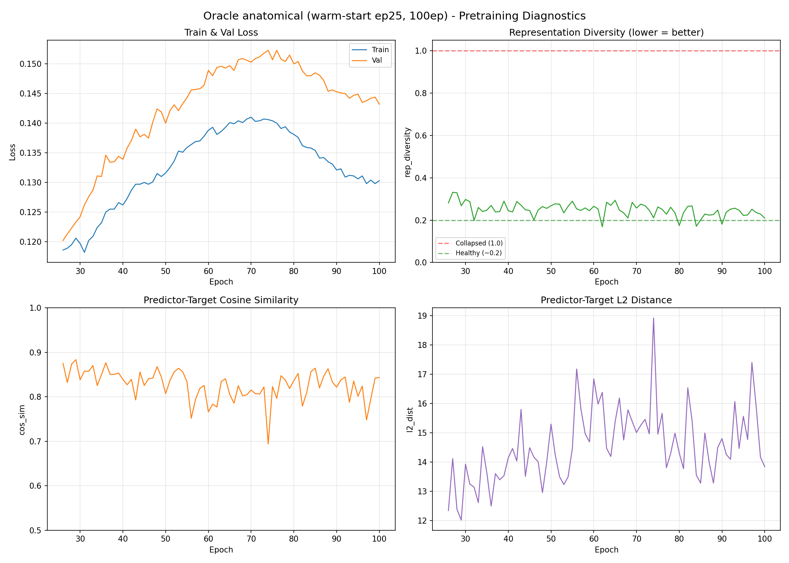
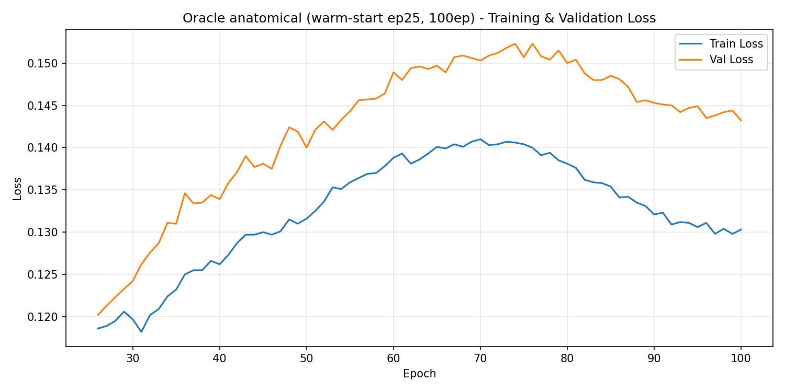
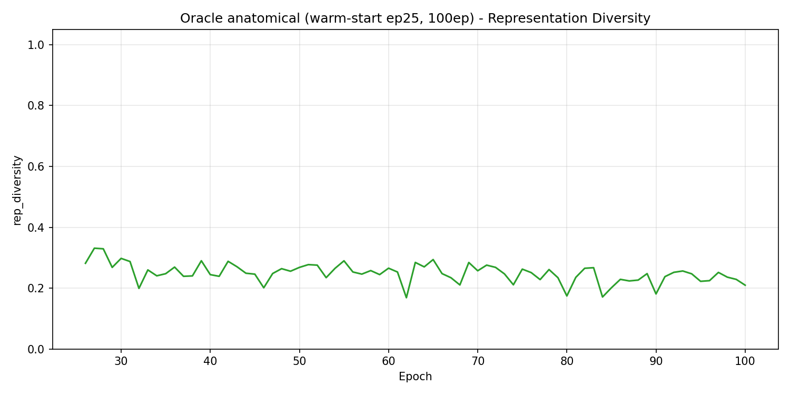
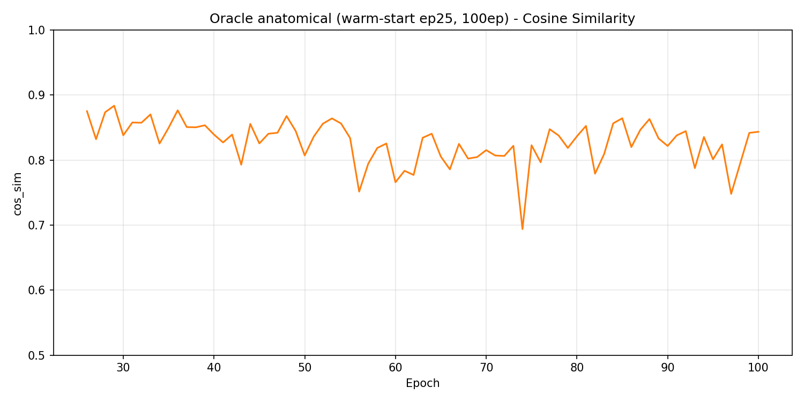

# Pretraining: Oracle anatomical-prior (warm-start ep25, 100ep)

Oracle (hand-guided) masking run. Warm-started from **ep25 of the random-init run** (`d1_sweep.md` baseline, `patch_vit_base_ps16_ep100_bs64_lr0.00025_20260411_063607`), then trained ep26→100 with a curriculum that ramps random masking into the **anatomical-prior oracle** (target blocks biased onto a per-slice retina-following band). **Completed** 2026-06-05 — all checkpoints downloaded; AML job can be deleted.

This is Rung 1 of the masking ladder: does biasing the JEPA target blocks onto the diagnostic retinal band produce a better/faster encoder than random masking? Pretraining diagnostics here; downstream AUC in `../frozen/`.

## Lineage (why the comparison is clean)

```
random-init run:  ep0 ───────────────────────────► ep100   (all random masking)   ← d1_sweep.md baseline
                       │
                       ├─ ep25 fork (warm-start)
                       ▼
oracle run:            ep25 ──[curriculum ep26–30]──► ep100  (anatomical_prior, r_t=1 from ep30)
```

Oracle ep25 ≡ random ep25 (fork point, r_t=0). Real divergence is ep50/75/100, all under full oracle masking.

## Config

| Parameter | Value | vs random |
|-----------|-------|-----------|
| Architecture | ViT-B/16 | same |
| Initialization | **Warm-start from random ep25** | random: from scratch |
| Masking | **Curriculum → anatomical_prior oracle** | random: uniform blocks |
| Curriculum | T_warm=25, T_total=30, r_max=1.0, linear ramp | n/a |
| Oracle band | lateral_frac=0.6, region_frac=0.28, row_offset=0.0 | n/a |
| I-JEPA masking | enc 0.85–1.0, pred 0.15–0.2, nenc=1, npred=4 | same |
| Learning Rate | 0.00025 (cosine → 1e-6), start 1e-4, warmup 5 | same |
| EMA | [0.996, 1.0] cosine | same |
| Weight Decay | 0.04 → 0.4 (cosine) | same |
| Batch | 64/GPU × 4 GPU × 2 accum = **512 effective** | same |
| Num slices | 100 | same |
| Patience | 9999 (disabled) | same |
| Total Epochs | 100 | same |
| Blob prefix | `ijepa-results/patch_vit_base_ps16_ep100_bs32_lr0.00025_20260602_093108` | — |

(Output-dir tag says `bs32`; actual run config is `batch_size=64` × 2 accum = 512 effective, matching random for apples-to-apples.)

## Diagnostic Plots



| Plot | Description |
|------|-------------|
|  | Train & val loss. Rises into a mid-run peak (~ep60–75) then eases — same shape as random, slightly lower in absolute terms. |
|  | Representation diversity. 0.17–0.33 throughout (healthy; **no collapse**). ep100 = 0.210. |
|  | Predictor-target cosine. 0.69–0.88; dips to 0.69 mid-run (hardest phase) then recovers to 0.84. |

## Training Summary

| Epoch | r_t | train_loss | val_loss | cos_sim | rep_div | l2_dist | EMA |
|-------|-----|-----------|----------|---------|---------|---------|-----|
| 26 | 0.20 | 0.1186 | 0.1202 | 0.875 | 0.282 | 12.34 | 0.997 |
| 30 | **1.00** | 0.1197 | 0.1242 | 0.838 | 0.298 | 13.93 | 0.997 |
| 35 | 1.00 | 0.1232 | 0.1310 | 0.850 | 0.247 | 13.62 | 0.997 |
| 50 | 1.00 | 0.1316 | 0.1400 | 0.807 | 0.268 | 15.29 | 0.998 |
| 60 | 1.00 | 0.1388 | 0.1489 | 0.766 | 0.266 | 16.84 | 0.999 |
| 75 | 1.00 | 0.1404 | 0.1507 | 0.823 | 0.262 | 14.95 | 0.999 |
| 88 | 1.00 | 0.1335 | 0.1454 | 0.863 | 0.226 | 13.28 | 1.000 |
| 95 | 1.00 | 0.1306 | 0.1449 | 0.801 | 0.222 | 15.56 | 1.000 |
| **100** | 1.00 | **0.1303** | **0.1432** | 0.844 | 0.210 | 13.84 | 1.000 |

## Oracle vs Random at matched epochs

| Epoch | Oracle train / val | Random train / val | Oracle rep_div / cos | Random rep_div / cos |
|-------|--------------------|--------------------|----------------------|----------------------|
| 25/26 | 0.119 / 0.120 | 0.117 / 0.120 | 0.28 / 0.88 | 0.28 / 0.87 |
| 50 | **0.132 / 0.140** | 0.141 / 0.142 | 0.27 / 0.81 | 0.20 / 0.85 |
| 75 | **0.140 / 0.151** | 0.145 / 0.147 | 0.26 / 0.82 | 0.24 / 0.84 |
| 100 | **0.130 / 0.143** | 0.135 / 0.142 | 0.21 / 0.84 | 0.23 / 0.87 |

## Problem check (the point of this doc)

1. **No collapse.** rep_diversity stays 0.17–0.33 (1.0 = collapsed); ep100 = 0.210, marginally *better* than random's 0.229. cos_sim 0.69–0.88. Healthy throughout. ✅
2. **Curriculum executed exactly as designed.** r_t = 0.0(ep25) → 0.2 → 0.4 → 0.6 → 0.8 → **1.0(ep30)**, held at 1.0 through ep100. Confirms the `T_total=30` hard-switch fix held (loop's 100-epoch total did not override the config). ✅
3. **Loss is not "harder."** At matched epochs the oracle's train/val loss is slightly *lower* than random (ep100: 0.130/0.143 vs 0.135/0.142), not higher. My mid-run guess ("masking the retina is a harder task → higher loss") does **not** hold over the full run — predicting a contiguous anatomical band is, if anything, marginally easier in raw loss. Per `lessons_learned.md` #1, loss is not the quality signal anyway; downstream AUC is. ✅
4. **Mid-run stress phase (ep55–65) — the one thing to understand, not a failure.** cos_sim dips to its min 0.69, l2_dist peaks 18.9, loss peaks — as the EMA target matures under full oracle masking. It **recovers** by ep88 (cos_sim 0.86, rep_div 0.23). Watch that downstream ep50 is not unusually weak because of it. ⚠️
5. **Mild train/val gap at ep100** (0.013 vs random's 0.007) — slightly more specialized/overfit-leaning, expected for a task-biased objective. Flag for the downstream sweep. ⚠️

## Available Checkpoints (downloaded locally)

| Checkpoint | Epoch | Local path |
|-----------|-------|-----------|
| `jepa_patch_oracle-best.pth.tar` | 26 (lowest val; r_t still ramping — **do not use for downstream**) | `results/pretraining/pretrain_oracle_anatomical/` |
| `jepa_patch_oracle-ep50.pth.tar` | 50 | same |
| `jepa_patch_oracle-ep75.pth.tar` | 75 | same |
| `jepa_patch_oracle-ep100.pth.tar` | 100 | same |
| (ep25) | 25 | ≡ random ep25 fork point; not re-uploaded |

Checkpoints/CSV/log are gitignored (size); only the doc + PNGs are committed. AML job safe to delete — all artifacts are local.

## Notes

- `best` = ep26 (val_loss 0.1202, lowest) because val is lowest while r_t is still ramping. Same warmup/best-save caveat as the random run. For downstream use **fixed** ep50/75/100, never `best`.
- Downstream plan: reproduce `frozen/d1_sweep.md` on oracle ep50/75/100 (ep25 = 0.8558 from random), overlay vs random curve — test "same AUC at lower epoch" (left-shift) vs "higher AUC at ep100".
